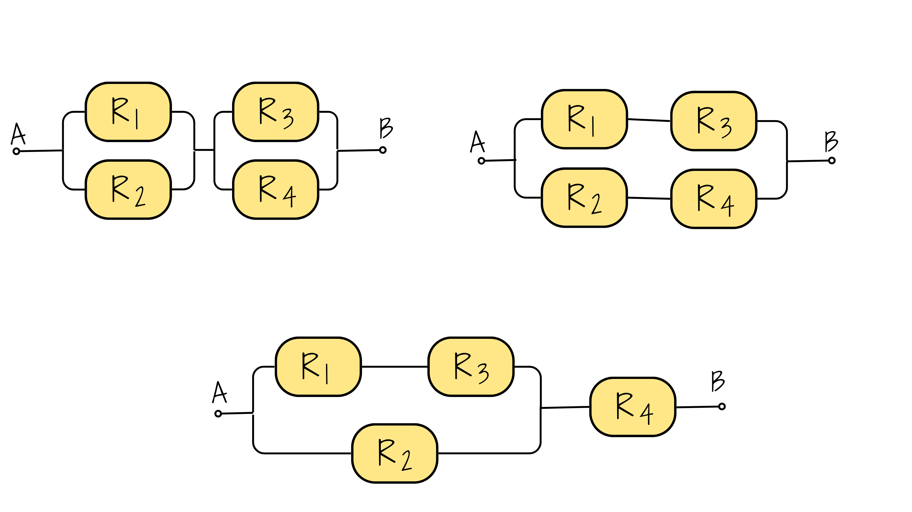
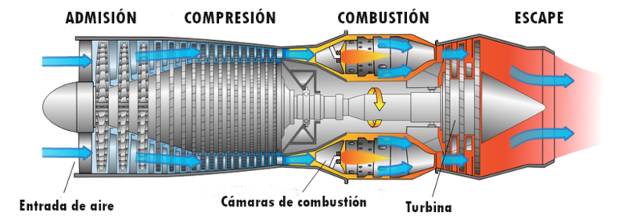

---
title: " "  
subtitle: " "  
author: "dgonzalez "
output:
  html_document:
    toc: no
    toc_depth: 2
    toc_float: yes
    code_folding: hide
    theme: flatly
    css: style.css
---      


```{r setup, include=FALSE}
options(htmltools.dir.version = FALSE)
knitr::opts_chunk$set(
  fig.width=9, fig.height=3.5, fig.retina=3,
  out.width = "100%",
  cache = FALSE,
  echo = TRUE,
  message = FALSE, 
  warning = FALSE,
  hiline = TRUE
)
# colores
source("R/init.R")

paleta4=c(c11,c21,c31,c41)


library(forcats)
library(patchwork)
library(lubridate)
library(ggplot2)
library(gridExtra)
library(cowplot)
library(summarytools)

#library(dviz.supp)
```


</br></br></br>

```{r, echo=FALSE, out.width="100%", fig.align = "left"}
# nitr::
```
</br></br></br>

# **Actividad 332**

Cada estudiante tiene a su cargo la solución de cuatro problemas utilizando simulación de modelos estadísticos (ver tabla al final).
Después de revisar los problemas asignados, podrá intercambiar uno de ellos por otro de los no asignados, si así lo desea.

En caso de realizar el cambio, será necesario incluir una nota al inicio del documento indicando el ejercicio sustituido y el nuevo ejercicio resuelto.

<br/><br/>


# **Problemas de simulación**

<br/><br/>

<div class="box2 with-label">
<div class="label">Problema 1</div>


Alejandra es la persona encargada de las compras para un gran laboratorio de investigaciones biológicas. Uno de los principales insumos utilizados en el laboratorio son reactivos especializados, los cuales se compran a dos fabricantes internacionales de gran renombre. Debido a problemas logísticos durante el transporte, se estima que cada unidad de reactivo tiene una probabilidad de $0.03$ de estar contaminada o defectuosa en el caso del primer fabricante, y una probabilidad de $0.05$ para el segundo fabricante. Usted recibe un envío de $100$ reactivos.

<br/>

```{r, echo=FALSE, out.width="45%", fig.align = "center"}
# knitr::include_graphics("img/lab1.png")
```

<br/>

a. Sea $X$ el número de unidades defectuosas en el envío del fabricante 1  y $Y$ del número de unidades  defectuosas provenientes del fabricante 2 . ¿Cuáles son las distribuciones de las variables $X$ y $Y$?
b. Genere muestras simuladas de tamaño $1000$ a partir de las distribuciones de $X$ y $Y$.
c. Utilice las muestras para estimar la probabilidad de que el número total de unidades defectuosas sea menor a diez.
d. Utilice las muestras para estimar la probabilidad de que el envío del primer fabricante  se presentaran más unidades  defectuosas que el envío realizado por el segundo fabricante.
e. Construya una gráfica de probabilidad normal para el número total de unidades defectuosas. ¿Sigue una distribución normal?

</div>

</div>

<br/><br/><br/><br/>


<div class="box2 with-label">
<div class="label">Problema 2</div>

La edad de una antigua pieza de materia orgánica se puede estimar a partir de la tasa a la que emite partículas beta como resultado del decaimiento del carbono-14. Por ejemplo , si X es el número de partículas emitidas durante diez minutos por un fragmento óseo con 10000 años de antigüedad  que contiene 1 g de carbono, entonces X tiene una distribución de Poisson con media $\lambda=45.62$ . Un arqueólogo descubrió un pequeño fragmento óseo que contiene 1 g de carbono. Si t es la edad desconocida del hueso, en años, el arqueólogo contar{a el número X de partículas emitidas en diez minutos y calculará una edad estimada $\widehat{t}$ con la fórmula:
	
$$\widehat{t}=\dfrac{\ln 15.3 - \ln (X/10)}{0.0001210} $$ 
	
El arqueólogo no lo sabe, pero el hueso tiene exactamente $10000$ años de antigüedad, por lo que $X$ tiene una distribución de Poisson con $\lambda=45.62$.
	
<br/>
	
```{r, echo=FALSE, out.width="30%", fig.align = "center"}
# 
```
	
<br/>

a. Genere una muestra simulada de 10000 valores de $X$ y sus correspondientes valores de $\widehat{t}$.
b. Estime la media de $\widehat{t}$.
c. Estime la desviación estándar de $\widehat{t}$.
d. Estime la probabilidad de que $\widehat{t}$ esté a 1000 años con una edad real de 10000 años.
	
</div>
	

<br/><br/><br/><br/>
	
<div class="box2 with-label">
<div class="label">Problema 3</div>
	
Tres sistemas están compuestos por los componentes `R1`,`R2`, `R3` y `R4` conectados,  como lo muestra las siguientes figuras. El tiempo de vida en meses de los componentes `R1` y `R3` sigue una distribución lognormal con $\mu=2$ y $\sigma=1$ y la distribución en meses de los componentes `R2` y `R4` una distribución lognormal con $\mu=1$ y $\sigma=0.1$. El sistema solo funciona si `A` y `B` lo hacen.
	
<br/>
	
```{r, echo=FALSE, out.width="40%", fig.align = "center"}
# 
```
	
<br/>
	
a. Genere por simulación un gran número  (al menos $1000$) de los tiempos de vida de los sistemas
b. Estime la media del tiempo de vida para cada sistema.
c. Estime la probabilidad de que los sistemas fallen en un tiempo inferior a dos meses.
d. Estime el $20^{o}$ percentil ($P_{20}$) de los tiempos de vida del primer sistema .
e. Construya una gráfica de probabilidad normal de los tiempo de vida para cada sistema. ¿Los tiempos de vida de los sistemas tienen una distribución aproximadamente normal?
f. Construya un histograma de los tiempos de vida de los sistemas. ¿Están sesgados a la izquierda, sesgados a la derecha, o son aproximadamente simétricos?
</div>
	
<br/><br/><br/><br/>
	
<div class="box2 with-label">
<div class="label">Problema 4  </div>
	
	
Estimación del valor de $\pi$ . LA siguiente figura sugiere como estimar el valor de $\pi$ con una simulación. En la figura, un círculo con área igual a $\pi/4$, está inscrito en un cuadrado cuya área es igual a 1. Se elige de forma aleatoria 100 puntos dentro del cuadrado . La probabilidad de que un punto esté dentro del círculo es igual a la fracción del área del cuadrado que abarca a este, la cual es $\pi/4$. Por tanto, se puede estimar el valor de $\pi/4$ al contar el número de puntos dentro del círculo, que es 79 para obtener la estimación de $\pi/4 \approx 0.76$ . De este último resultado se concluye que $\pi \approx 4(0.79) =3.14$ . Este ejercicio presenta un experimento de simulación que fue diseñado para estimar el valor de $\pi$ al generar 1000 puntos en el cuadrado.
	
<br/>
	
```{r, echo=FALSE, out.width="40%", fig.align = "center"}
# knitr::include_graphics("img/fig_pi.png")
```
	
<br/>
	
a. Genere 1000 coordenadas $x$:  $X_{1}$, . . . , $X_{1000}$. Utilice la distribución uniforme con valor mínimo de $0$ y valor máximo de $1$. La distribución uniforme genera variables aleatorias que tienen la misma probabilidad de venir de cualquier parte del intervalo $(0, 1)$.
	
b. Genere $1000$ coordenadas $y$ : $Y_{1}, . . . , Y_{1000}$, utilizando nuevamente la distribución uniforme con valor mínimo de $0$ y valor máximo de $1$.
	
c. Cada punto $(X_{i},Y_{i})$ se encuentra dentro del círculo si su distancia desde el centro $(0.5, 0.5)$ es menor a $0.5$. Para cada par $(X_{i},Y_{i})$ determine si la distancia desde el centro es menor a $0.5$. Esto último se puede realizar al calcular el valor $(X_{i}-0.5)^{2}+(Y_{i}-0.5)^{2}$, que es el cuadrado de la distancia, y al determinar si es menor que $0.25$.
	
d. ¿Cuántos de los puntos están dentro del círculo? ¿Cuál es su estimación de $\pi$? (Nota: Con sólo 1000 puntos, es probable que su estimación sea inferior por 0.05 o más. Una simulación con 10000 y 100000 puntos tiene mayores probabilidades de dar como resultado una estimación muy cercana al valor verdadero
	
</div>
	
<br/>
	
Ejercicios tomados de Navidi(2006)
	
<br/><br/><br/>

<div class="box2 with-label"> <div class="label">Problema 5 </div>
	
Una planta de manufactura produce pistones para motores de combustión interna. El diámetro de los pistones debe ser de 10 cm, pero debido a variaciones en el proceso de producción, sigue una distribución normal con media $\mu = 10$ cm y desviación estándar $\sigma = 0.02$ cm. Un pistón es rechazado si su diámetro está fuera del rango de 9.97 cm a 10.03 cm.
	
```{r, echo=FALSE, out.width="40%", fig.align = "center"}
# knitr::include_graphics("img/piston.png")
```
	
a. Genere una muestra simulada de 5000 pistones.
b. Estime la proporción de pistones rechazados por no cumplir con las especificaciones.
c. Si el costo de reprocesamiento de un pistón defectuoso es de $15 USD, estime el costo promedio de reprocesamiento por cada 5000 pistones fabricados.
d. Genere un histograma del diámetro de los pistones y evalúe si se ajusta a la distribución normal.
e. ¿Qué estrategias podrían implementarse para reducir el número de pistones rechazados?

</div>

<br/><br/><br/><br/>

<div class="box2 with-label"> <div class="label">Problema 6</div>

Un servidor web recibe en promedio 30 solicitudes por minuto. Se ha determinado que el número de solicitudes sigue una distribución de Poisson. Un equipo de desarrolladores desea simular el comportamiento del servidor durante las horas pico.

<br/>
```{r, echo=FALSE, out.width="30%", fig.align = "center"}
# knitr::include_graphics("img/servidor.png")
```

<br/>

a. Simule 10000 minutos de solicitudes utilizando la distribución de Poisson con $\lambda = 30$.
b. Estime la probabilidad de que en un minuto lleguen más de 40 solicitudes.
c. Si el servidor puede manejar hasta 35 solicitudes por minuto sin colapsar, estime la proporción de minutos en los que se sobrecarga el servidor.
d. ¿Qué mejoras podría implementar el equipo de sistemas para disminuir el riesgo de sobrecarga?
e. Construya un histograma con la distribución de solicitudes por minuto. ¿Qué tan dispersa es la demanda?

</div>

<br/><br/><br/><br/>

<div class="box2 with-label"> <div class="label">Problema 7</div>

Una constructora está evaluando la resistencia a la compresión de cilindros de concreto a los 28 días de curado. La resistencia sigue una distribución normal con media $\mu = 30$ MPa y desviación estándar $\sigma = 5$ MPa. Se requiere que el 95% de los cilindros superen los 25 MPa.

<br/>

```{r, echo=FALSE, out.width="20%", fig.align = "center"}
# knitr::include_graphics("img/concreto.png")
```
<br/>

a. Genere una muestra simulada de 10000 cilindros de concreto.
b. Estime el porcentaje de cilindros que cumplen con la resistencia mínima de 25 MPa.
c. Estime el $10^{o}$ percentil ($P_{10}$) de la resistencia a la compresión.
d. Si un cilindro que no cumple cuesta $50 USD en reprocesamiento, estime el costo promedio asociado a los rechazos en 10000 cilindros.
e. ¿Qué medidas de control de calidad sugerirías implementar para mejorar el desempeño de la mezcla de concreto?

</div>

<br/><br/><br/><br/>

<div class="box2 with-label"> <div class="label">Problema 8 </div>

Una turbina de gas tiene cuatro componentes críticos que fallan de manera independiente. Los tiempos de vida (en horas) de cada componente siguen distribuciones exponenciales:

Componente 1: $\lambda = 1/5000$
Componente 2: $\lambda = 1/4000$
Componente 3: $\lambda = 1/6000$
Componente 4: $\lambda = 1/5500$

La turbina deja de funcionar cuando el primer componente falla.

<br/>
```{r, echo=FALSE, out.width="40%", fig.align = "center"}
# 
```
<br/>

a. Genere 5000 simulaciones del tiempo de vida de la turbina.
b. Estime la vida media de la turbina.
c. Estime la probabilidad de que la turbina falle antes de 4000 horas.
d. Construya el histograma del tiempo de vida de la turbina y comente sobre su forma.
e. ¿Qué estrategias de mantenimiento preventivo se pueden considerar?

</div>

<br/><br/><br/><br/>


<div class="box2 with-label"> <div class="label">Problema 9</div>

El caudal máximo diario de un río se modela como una distribución Gumbel con parámetros $\mu = 500$ m³/s y $\beta = 100$ m³/s. Un puente ha sido diseñado para resistir caudales de hasta 750 m³/s. Se desea estimar la probabilidad de que el puente sea superado en los próximos 10 años.

<br/>

```{r, echo=FALSE, out.width="30%", fig.align = "center"}
# knitr::include_graphics("img/caudal.png")
```
<br/>

a. Genere 3650 simulaciones (equivalente a 10 años) del caudal máximo diario.
b. Estime la probabilidad de que en al menos un día en los próximos 10 años el caudal supere los 750 m³/s.
c. Si se desea reducir el riesgo de superación al 1%, ¿qué caudal máximo debería resistir el nuevo diseño del puente?
d. Construya el histograma de los caudales simulados y analice la distribución.
e. ¿Qué medidas adicionales de mitigación podría implementar el ingeniero civil a cargo?

</div>

	
<br/><br/><br/>


## Asignación de problemas

```{r, eval=FALSE,message=FALSE, warning=FALSE}

set.seed(123)
library(dplyr)
library(kableExtra)

n <- 21 # Número de estudiantes
m <- 4  # Número de problemas asignados por estudiante

# Genera la matriz de problemas SIN repetidos en cada fila
# problema <- t(
#   replicate(n, sample(1:9, m, replace = FALSE))
# )
# 
# problemas =saveRDS(problema, "data/problemas.RDS")

# Lista de nombres (verifica que la cantidad de nombres sea igual a n)
nombres <- c("Esteban	Arismendi Giglioli", "Maria	Chaves Raymond", "Samuel	Cuervo Peña", "Miguel Angel	Davila Muelas", "Juan	Espinosa Arias", "Santiago	Guevara Idarraga", "Tomas	Henao Rincon", "Sebastian	Hidalgo Jimenez", "Juan	Iglesias Martinez", "Salome	Lema Franco", "Santiago	Mazo Andrade", "Jose	Mesa Velasquez", "Cristian	Osorio Martinez", "Santiago	Otalvaro Garcia", "Miguel	Padilla Rosero", "Juan	Ramirez Rivas", "Estevan	Rubio Urrego", "Lis	Saavedra Hernandez", "Juan	Sanchez Morillo",
"Jose	Silva Hurtado", "Mariana	Simons Gonzalez")

problema <-readRDS("data/problemas.RDS")
problema <- problema[1:21,]

# Crea el data.frame combinando nombres e ID con los problemas
datos <- data.frame(
  ID = 1:n,
  Nombre = nombres,
  Problema1 = problema[, 1],
  Problema2 = problema[, 2],
  Problema3 = problema[, 3],
  Problema4 = problema[, 4]
)

# Muestra la tabla en formato bonito
datos %>%
  kbl() %>%
  kable_styling(bootstrap_options = c("striped", "hover", "condensed", "responsive"))
```

