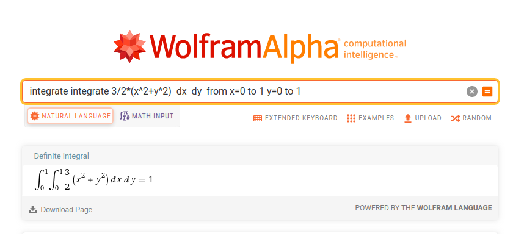

---
title:  " "
subtitle: "  " 
author: "dgonzalez "
output:
  html_document:
    toc: no
    toc_depth: 2
    toc_float: yes
    code_folding: hide
    theme: flatly
    css: style.css
---   

```{r setup, include=FALSE}
knitr::opts_chunk$set(echo = TRUE, message = FALSE, warning = FALSE, comment = NA)
library(psych)
library(summarytools)
library(tidyverse)
# install.packages("devtools")
#devtools::install_github("dgonxalex80/paqueteDEG")
#library(paqueteDEG)

# colores
source("R/init.R")

# install.packages('gtools')
# install.packages("TeachingSampling")

#load library
#library(gtools)
#library(TeachingSampling)
#library(readr)
#base_muestreo <- read_delim("data/base_muestreo.csv", 
#    delim = ";", escape_double = FALSE, col_types = cols(ID = col_integer()), 
#    trim_ws = TRUE)


```


```{r, echo=FALSE, out.width="100%", fig.align = "center"}

```

<br/><br/>

# **Caso Discreto-Discreto** 

<br/><br/>

### **Ejemplo 1**

El número de veces que falla una máquina $X$ con $R_{X}=\{1,2,3\}$ durante un dia y el número de veces en que el operario requiere llamar al técnico para su arreglo esta dado por $Y$ con $R_{Y}=\{1,2,3\}$. Su función de probabilidad conjunta para $X,Y$ está dada por :

|    |        |       |  $x$ |      |
|:--:|:------:|:-----:|:----:|:----:|
|    |$f(x,y)$| 1     |  2   |  3   |
|$y$ |  1     | 0.05  | 0.05 | 0.10 |
|    |  2     | 0.050 | 0.10 | 0.35 |
|    |  3     | 0     | 0.20 | 0.10 |

<br/><br/>

Función de distribución de probabilidad conjunta

```{r}
fxy=matrix(c(0.05,0.05,0,0.05,0.10,0.20,0.10,0.35,0.10), ncol=3 )
fxy
sum(fxy)
```

<br/><br/>

### **Funciones distribución marginales**

```{r}
fxy=matrix(c(0.05,0.05,0,0.05,0.10,0.20,0.10,0.35,0.10), ncol=3 )
fxy=addmargins(fxy,c(1,2))
colnames(fxy)=c("1","2","3","h(y)")
rownames(fxy)=c("1","2","3","g(x)")
fxy
```

<br/><br/>

### **Representación gráfica de $f(x,y)$**

Para construir la gráfica de X y Y debemos crear los vectores

|      |      |      |      |      |      |      |      |      |      |
|:----:|:----:|:----:|:----:|:----:|:----:|:----:|:----:|:----:|:----:|
|x     | 1    |     1|     1|     2|     2|     2|     3|     3|     3|
|y     | 1    |     2|     3|     1|     2|     3|     1|     2|     3|
|fxy   |  0.15|  0.05|     0|     0|  0.20|  0.35|     0|  0.10|  0.15|


```{r}
x=1:3
y=1:3
x=rep(x,each=3)
y=rep(y,3)
fxy=c(0.15,0.05,0, 0,0.20,0.35, 0,0.10,0.15)

plot3D::scatter3D(x, y, fxy,
          colvar = NULL, 
          col = c32,
          pch = 19, cex = 1,
          phi = 20, theta = 60,  
          zlab="f(xy)", xlab="x", ylab="y",
          bty = "b2",
          col.panel ="steelblue",
          col.grid = "darkblue",
          add_lines=TRUE)


```

<br/><br/>

### **Funciones de distribución marginal**

```{r}
fxy=matrix(c(0.05,0.05,0,0.05,0.10,0.20,0.10,0.35,0.10), ncol=3 )
fxy=addmargins(fxy,c(1,2))
colnames(fxy)=c("1","2","3","h(y)")
rownames(fxy)=c("1","2","3","g(x)")
fxy
```

<br/><br/>

### **Covarianza y Correlación**

```{r, warning=FALSE, message=FALSE}
x=c(0,1,2) 
y=c(0,1,2)
fxy=matrix(c(0.15,0.05,0,0,0.20,0.35,0,0.10,0.15), ncol=3 )

fxy=addmargins(fxy,c(1,2))
colnames(fxy)=c("1","2","3","h(y)")
rownames(fxy)=c("1","2","3","g(x)")

fxy=as.table(fxy)
gx=fxy[,4]
hy=fxy[4,]


Ex=sum(x*gx)
Ex2=sum(x^2*gx)
Vx=Ex2-(Ex)^2

Ey=sum(y*hy)
Ey2=sum(y^2*hy)
Vy=Ey2-(Ey)^2

x=rep(x,each=3)
y=rep(y,3)
fxy=c(0.15,0.05,0,0,0.20,0.35,0,0.10,0.15)
Exy=sum(x*y*fxy)
CovXY=Exy-Ex*Ey
Rho=CovXY/sqrt(Vx*Vy)


```

<br/><br/>

```{r, warning=FALSE, message=FALSE, echo=FALSE}

cat("E(X)    = ", Ex, "\n")
cat("E(X2)   = ", Ex2, "\n")
cat("V(X)    = ", Vx, "\n")
cat("E(Y)    = ", Ey, "\n")
cat("E(Y2)   = ", Ey2, "\n")
cat("V(Y)    = ", Vy, "\n")

cat("E(XY)   = ", Exy, "\n")
cat("Cov(XY) = ", CovXY, "\n")
cat("Rho     = ", Rho, "\n")
```


<br/><br/><br/>

# **Caso Continuo-continuo**  

<br/><br/>

**Ejemplo 2**


Una empresa prestadora se servicios a domicilio tienen dos lineas telefónicas para que los clientes puedan realizar sus pedidos. Sea X y Y la proporción del tiempo en que las lineas se encuentran ocupadas. La función de densidad conjunta que modela $f(x,y)$ esta dada por:

$$f(x,y) = \left \{ \begin{matrix} \dfrac{3}{2}(x^{2}+y^{2}) & \mbox{ } 0 \leq x \leq 1\\ 
                                     & \mbox{ } 0 \leq y \leq 1 \\
                                     &\\
                                   0 & \mbox{ en otro caso }\end{matrix}\right.$$
<br/><br/>

Inicialmente se verifica la condición :

 $\displaystyle\int_{0}^{1} \displaystyle\int_{0}^{1} \dfrac{3}{2}(x^{2}+y^{2}) \:dx \:dy  = 1$
 


```{r}
library(cubature) 
fxy <- function(x) { 3/2*(x[1]^2 + x[2]^2)} # 
adaptIntegrate(fxy, lowerLimit = c(0, 0), upperLimit = c(1, 1))
```

basado en : http://homepages.math.uic.edu/~jyang06/stat401/handouts/handout8.pdf


<br/><br/>

Ahora su representación gráfica

```{r}
x=seq(0,1,length=10)
y=seq(0,1,length=10)
fxy=function(x,y){3/2*(x^2+y^2)}
z=outer(x, y, fxy)
persp(x,y,z,theta = 20, phi = 20,expand=0.5, col = c31,
      xlab = "x", ylab ="y", zlab = "f(x,y)",
      main=" ", col.main=c32)


```

Nota: basada en : https://estadistica-dma.ulpgc.es/cursoR4ULPGC/9e-grafPersp.html

<br/><br/>

### **Otras alternativas**

<br/>


<br/><br/>


<br/><br/><br/>

## **Otros gráficos**


$$f(x,y) = \left \{ \begin{matrix} \dfrac{2}{3}\Big(x+2y\Big) & \mbox{ } 0 \leq x \leq 1\\ 
                                     & \mbox{ } 0 \leq y \leq 1 \\
                                     &\\
                                   0 & \mbox{ en otro caso }\end{matrix}\right.  $$


```{r, eval=FALSE}
library("scatterplot3d")
x <- c(0,1,1,0,0) 
y <- c(0,0,1,1,0) 
z <- c(0,1,2,1,0) 
s <- scatterplot3d(x,y,z, type='l',xlim=c(0,1),ylim=c(0,1),zlim=c(0,2), angle=45,
                   xlab="x", ylab="y", zlab="f(x,y) ",scale.y=0.7,cex.axis=.7, cex.names = .7, lwd=3,
                   grid=TRUE, box=TRUE,
                   label.tick.marks=TRUE)

# plano XY
x0=c(0,1,1,0)
y0=c(0,0,1,1)
z0=c(0,0,0,0)
polygon(s$xyz.convert(x0,y0,z0),col="#0000ff11") # morado claro

# Funcion de densidad de probabilidad f(x,y)
x1=c(0,1,1,0)
y1=c(0,0,1,1)
z1=c(0,1,2,1)
polygon(s$xyz.convert(x1,y1,z1),col=c31) # morado 


```

<br/><br/>

```{r, eval=FALSE}
# Cargar la librería rgl
library(rgl)

# Definir la función f(x, y)
f_xy <- function(x, y) {
  return((2/3) * (x + 2*y))
}

# Crear una secuencia de valores para x e y
x <- seq(0, 1, length.out = 100)
y <- seq(0, 1, length.out = 100)

# Crear la malla de valores
z <- outer(x, y, f_xy)

# Crear la gráfica con color rojo y 70% de opacidad en la superficie
# El código de color hexadecimal con 70% de opacidad es #FF0000B3
persp3d(x, y, z, color = c21, alpha = 0.3, back = "lines", front = "fill")

# Configurar los parámetros para controlar la opacidad
material3d(alpha = 0.7)


```


$$P(X \geq 0.5 ; Y \geq 0.5) = \int_{0.5}^{1} \int_{0.5}^{1} \dfrac{2}{3}\Big(x+2y\Big) \:dx \:dy$$

```{r, eval=FALSE}
library("scatterplot3d")
x <- c(0,1,1,0,0) 
y <- c(0,0,1,1,0) 
z <- c(0,1,2,1,0) 
s <- scatterplot3d(x,y,z, type='l',xlim=c(0,1),ylim=c(0,1),zlim=c(0,2), angle=45,
                   xlab="x", ylab="y", zlab="f(x,y) ",scale.y=0.7,cex.axis=.7, cex.names = .7,lwd=2,
                   grid=TRUE, box=TRUE,
                   label.tick.marks=TRUE)


# plano fxy - techo  
x4=c(.5,1,1,.5)
y4=c(.5,.5,1,1)
z4=c(1 ,1.5,2,1.5)
polygon(s$xyz.convert(x4,y4,z4),col=c32, lwd=4)  #violeta

# frente 
x5=c(0.5,1,1,0.5)
y5=c(0.5,0.5,0.5,0.5)
z5=c(0,0,1.5,1)
polygon(s$xyz.convert(x5,y5,z5),col=c31,lwd=4) # azul claro

# lateral derecho 
x6=c(1,1,1,1)
y6=c(.5,1,1,.5)
z6=c(0,0,2,1.5)
polygon(s$xyz.convert(x6,y6,z6),col=c31,lwd=4) # azul claro
# lateral izquierdo si va transparente
x7=c(.5,.5,.5,.5)
y7=c(.5,1,1,.5)
z7=c(0,0,1.5,1)
polygon(s$xyz.convert(x7,y7,z7)) # 

```


<br/><br/>

 $$f_{XY}(x,y)=\left\{\begin{matrix}\ \dfrac{48}{49} xy^{2} & 3\leq x \leq 4, \hspace{.5cm} 0.5 \leq y \leq 1 \\ & \\
 0 & \mbox{para cualquier otro caso} \end{matrix}\right.$$

```{r,eval=FALSE}
 library(lattice)
x=seq(3,4,by=0.03)
y=seq(0.5,1,by=0.03)
fun=function(x,y){48*x*y^2/49}
z=outer(x,y,fun)
wireframe(z,xlab="x",ylab="y",zlab="f(x,y)",col=c6)
```

```{r, warning=FALSE, message=FALSE, fig.align='center'}
x=seq(3,4,by=0.03)
y=seq(0.5,1,by=0.03)
fxy=function(x,y){48*x*y^2/49}
z=outer(x, y, fxy)
persp(x,y,z,theta = 40, phi = 10,expand=0.5, col = c32,
      xlab = "x", ylab ="y", zlab = "f(x,y)",
      main=" ", col.main="blue")
```


<br/><br/>


```{r, eval=FALSE}
# tomada de:
# http://pj.freefaculty.org/R/WorkingExamples/plot-3d-MVNormal-1.R
library("mvtnorm")

N=50
x <- seq(-3,3, length=N)
y <- seq(-3,3,length=N)
z <- matrix(0, N, N)
for (i in 1:N) for (j in 1:N) {
  z[i,j]=dmvnorm(c(x[i],y[j]), c(0,0),
        matrix(c(1,0.5,0.5,1),2,2))}
persp(x,y,z,theta=20, phi=15, 
      xlab="x", 
      ylab="y", 
      zlab="f(x,y)",
      scale=TRUE,
      expand=.4,
      axes=TRUE,
      col=c31)
```


