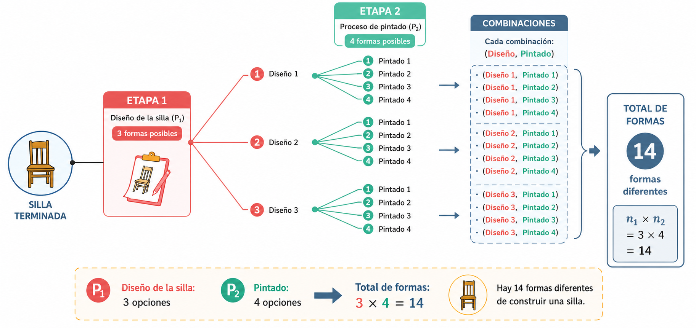
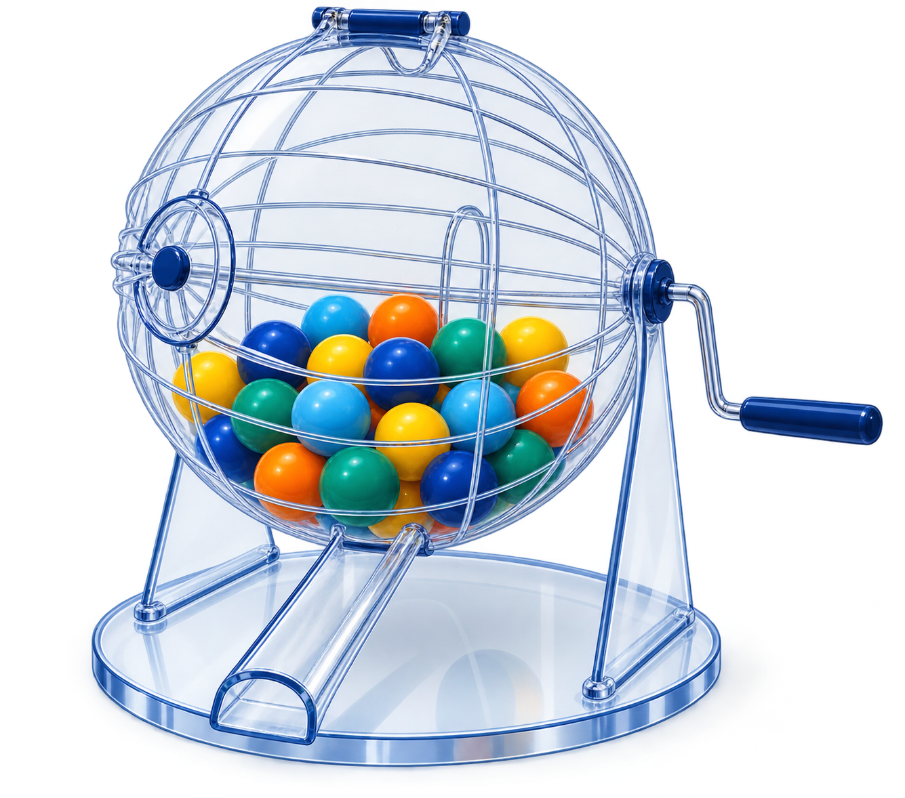

```{r setup, include=FALSE}
knitr::opts_chunk$set(echo = TRUE,comment = NA)


# colores
source("colores.R")


```


```{r, echo=FALSE, out.width="100%", fig.align = "center"}
 
```


</br>

# Técnicas de conteo

<br/><br/>

Las técnicas de conteo constituyen una serie de estrategias que permiten, mediante reglas, establecer el número de elementos de un conjunto finito.

Inicialmente empezaremos por definir dos reglas:

<br/><br/>

<div class="box1 with-label">
### Principio de la adicción

Supongamos que un procedimiento, designado con $P_1$, se puede hacer de $n_1$ maneras diferentes. Supongamos que un segundo procedimiento, $P_2$, se puede realizar de $n_2$ maneras diferentes. Además, los dos procedimientos no se pueden realizar juntos. Entonces, el número de formas diferentes de realizar $P_1$ o $P_2$ es $n_1+n_2$.

</div>

<br/><br/>


### Ejemplo

Una empresa debe seleccionar un proveedor para un insumo crítico. Puede contratar un **proveedor nacional**, para el cual existen 5 alternativas habilitadas, o un **proveedor internacional**, para el cual existen 6 alternativas. Como las dos categorías representan alternativas excluyentes para una misma contratación, $n_{1}=5$ y $n_{2}=6$. Por el principio de adición, el número total de proveedores que pueden seleccionarse es $n=n_{1}+n_{2}=11$.


<br/>


```{r, echo=FALSE, out.width="100%", fig.align = "center"}
knitr::include_graphics("img/psuma1.png")
```

<br/><br/><br/>

<div class="box1 with-label">
### Principio de la multiplicación

Supongamos que un procedimiento $P_1$ se puede realizar de $n_1$ maneras diferentes y que otro procedimiento $P_2$ se puede realizar de $n_2$ maneras diferentes. Si los procedimientos se realizan uno después del otro, el número de formas diferentes de realizar $P_1$ y $P_2$ consecutivamente es $n_1\times n_2$.

</div>

<br/><br/>


### Ejemplo

Una planta industrial debe configurar una línea de producción. Para la **tecnología de ensamble** ($P_{1}$) dispone de 3 alternativas y para el **sistema de inspección de calidad** ($P_{2}$) dispone de 4 alternativas. ¿De cuántas maneras diferentes puede configurarse la línea si cada tecnología de ensamble puede combinarse con cualquiera de los sistemas de inspección?


<br/><br/>

El número de configuraciones posibles de la línea será: $n_{1} \times n_{2}=3 \times 4=12$.


```{r, echo=FALSE, out.width="100%", fig.align = "center"}

```


<br/><br/>

# Otras técnicas de conteo

Para explicar un poco los otros casos de conteo utilizaremos el siguiente experimento aleatorio:

Se tiene una urna  que contiene $n$ elementos todos numerables ( se pueden contar) y de ellos se quiere seleccionar $k$ elementos como se muestra en  la siguiente figura.

<br/><br/>


```{r, echo=FALSE, out.width="35%", fig.align = "center"}

```

<br/><br/>

Este procedimiento se puede realizar de varias  formas:

A. Cuando importa el orden

+ $\mathcal{P}'(n,k)$ Con repetición o también llamada con sustitución

+ $\mathcal{P}(n,k)$ Sin repetición o sin sustitución

B. Sin importar el  orden

+ $\mathcal{C}'(n,k)$ Con repetición o también llamada con sustitución

+ $\mathcal{C}(n,k)$ Sin repetición o sin sustitución

<br/><br/>

Es decir que se definen  los siguientes procedimientos:

**A1** : $\mathcal{P}'(n,k)$: Conjunto formado por todas las manera posible como se puede seleccionar una  muestra de tamaño k de una urna que contiene n elementos cuando importa el orden, con  sustitución. En este procedimiento se hace diferencia de la posición que tienen los elementos al ser seleccionados y también que después de  la extracción de un elemento, este se regresa  a la urna antes  de  la siguiente selección. Esto implica que hay siempre en la urna n  elementos antes de la cada selección.

<br/><br/>

**A2** : $\mathcal{P}(n,k)$: Conjunto de todas la formas posibles como se puede seleccionar una muestra de tamaño k de una urna que  contiene n elementos cuando importa el orden, sin  sustitución. En este caso los elementos que son  seleccionados van  quedando por fuera de  la urna  y no participan en la siguiente selección.

<br/><br/>
**B1** : $\mathcal{C}'(n,k)$: Conjunto de  todas las maneras  posible como se puede  seleccionar una  muestra de tamaño k de una urna que contiene n  elementos sin importar el orden pero con  sustitución. En  esta  caso  no  tiene importancia el orden en que se seleccionan los elementos de la urna, pero  los elementos seleccionados  regresan  a  la  urna y podrían se seleccionados nuevamente.

<br/><br/>

**B2** : $\mathcal{C}(n,k)$: Conjunto  de  todas  las formas posibles como se puede selecciona una  muestra de tamaño k de una  urna que contiene n elementos, sin importar el  orden, pero en este caso los elementos seleccionados previamente son excluidos de la siguiente selección.

<br/><br/>

Contemplados estos casos vamos a definir la  forma  en  que se pueden contar  los conjuntos anteriores

<br/><br/>


<div class="box1 with-label">
### Importa el orden con sustitución

$$\mathcal{P}^{\prime}(n,k) = \underbrace{n \times n \times \cdots \times n}_{k\text{ factores}} = n^k$$

El número de maneras diferentes de extraer una muestra de tamaño $k$ de una urna con $n$ elementos, cuando importa el orden y hay sustitución, es $n^k$.

</div>

<br/><br/>


<div class="box1 with-label">
### Importa el orden sin sustitución

$$\mathcal{P}(n,k) = n \times (n-1) \times (n-2) \times \cdots \times (n-k+1) = \dfrac{n!}{(n-k)!}$$

El número de maneras diferentes de extraer una muestra de tamaño $k$ de una urna con $n$ elementos, cuando importa el orden y no hay sustitución, es $\dfrac{n!}{(n-k)!}$, que se lee «$n$ permutado con $k$».

</div>

<br/><br/>


Un ingeniero debe realizar visitas a 6 áreas de trabajo diferentes durante el día. A fin de impedir que los funcionarios sepan cuándo realizará su visita, varía el orden de sus visitas. ¿De cuántas maneras puede hacerlo?


<br/><br/>

$$ _{6}\mathcal{P}_{6} = \dfrac{6!}{(6-6)!}=6! =720$$

<br/><br/>

<div class="box1 with-label">
### No importa el orden sin  sustitución

$$\mathcal{C}(n,k) = \dfrac{n!}{(n-k)! k!}= \binom{n}{k}$$

El número de maneras diferentes de extraer una muestra de tamaño $k$ de una urna que contiene $n$ elementos, sin importar el orden y sin sustitución, es $\binom{n}{k}$, que se lee «$n$ combinado con $k$».

</div>

<br/><br/>


El juego del Baloto está conformado por una urna que contiene 45 bolas numeradas del 1 al 45. ¿De cuántas formas diferentes puede salir el resultado de un sorteo?


 <br/><br/>

De las 45 bolas se eligen 6 sin importar el orden y sin que ninguna de las bolas se repita. Este experimento cumple con las condiciones de una combinación.

El número de formas diferentes como se puede salir el resultado del Baloto será:

$$_{45}\mathcal{C}_{6} = \binom{45}{6}=8'145,060$$

<br/><br/>

<div class="box1 with-label">
### No importa el orden con sustitución

$$\mathcal{C}^{\prime}(n,k) = \binom{n+k-1}{k}$$

El número de maneras diferentes de extraer una muestra de tamaño $k$ de una urna con $n$ elementos, sin importar el orden y con sustitución, es $\binom{n+k-1}{k}$.

</div>

<br/><br/>

### Ejemplo: no importa el orden con sustitución

Un inversionista dispone de 6 unidades monetarias idénticas para distribuir entre 4 tipos de activos: renta fija, acciones, fondos inmobiliarios y liquidez. Cada activo puede recibir desde cero hasta las 6 unidades. Si únicamente interesa cuántas unidades se asignan a cada activo y no el orden en que se realizan las asignaciones, ¿cuántas estructuras diferentes de portafolio son posibles?

En este problema se seleccionan $k=6$ elementos entre $n=4$ tipos, se permiten repeticiones y el orden no importa. Por tanto:

$$
\mathcal{C}^{\prime}(4,6)=\binom{4+6-1}{6}=\binom{9}{6}=84.
$$

Una forma equivalente de interpretar este resultado consiste en contar las soluciones enteras no negativas de

$$
x_1+x_2+x_3+x_4=6,
$$

donde $x_i$ representa el número de unidades monetarias asignadas al activo $i$.

<br/><br/>

# Casos adicionales de conteo

Los cuatro procedimientos anteriores resuelven problemas de **selección de elementos distintos** según importe o no el orden y se permita o no repetición. Sin embargo, en probabilidad aparecen otros problemas de conteo que conviene distinguir. En particular, cuando se ordenan todos los elementos, cuando existen elementos indistinguibles o cuando los objetos deben distribuirse en grupos de tamaños previamente establecidos, se requieren fórmulas adicionales.

<br/><br/>

<div class="box1 with-label">
### Permutación de todos los elementos

Si se tienen $n$ elementos distintos y se desea ordenar **todos** ellos, el número de ordenamientos posibles es

$$
\mathcal{P}(n,n)=n!.
$$

Este caso es una situación particular de la permutación sin sustitución, tomando $k=n$.

</div>

### Ejemplo

En una planta deben programarse secuencialmente 7 órdenes de producción diferentes en una misma máquina. ¿Cuántas secuencias de procesamiento son posibles?

$$
7!=5040.
$$

<br/><br/>

<div class="box1 with-label">
### Permutaciones con elementos repetidos

Supongamos que se tienen $n$ objetos, pero algunos son indistinguibles entre sí. Si existen $n_1$ objetos de un primer tipo, $n_2$ de un segundo tipo, ..., $n_r$ de un tipo $r$, con

$$
n_1+n_2+\cdots+n_r=n,
$$

el número de ordenamientos diferentes es

$$
\frac{n!}{n_1!n_2!\cdots n_r!}.
$$

La división por $n_i!$ elimina los ordenamientos que parecen diferentes al intercambiar objetos que en realidad son indistinguibles.

</div>

### Ejemplo

Una mesa de negociación registra una secuencia diaria de 6 operaciones: 3 compras (C), 2 ventas (V) y 1 operación de cobertura (H). Si las operaciones del mismo tipo se consideran indistinguibles, ¿cuántas secuencias diferentes pueden observarse?

Se tienen 6 operaciones: tres C, dos V y una H. Por tanto,

$$
\frac{6!}{3!2!1!}=60.
$$

Este caso no debe confundirse con $\mathcal{P}'(n,k)=n^k$: en $n^k$ se realizan $k$ selecciones sucesivas y cada posición dispone nuevamente de $n$ alternativas; en una permutación con elementos repetidos se ordena un conjunto fijo que ya contiene elementos indistinguibles.

<br/><br/>

<div class="box1 with-label">
### Coeficiente multinomial

Una generalización de las combinaciones aparece cuando $n$ elementos distintos deben dividirse en $r$ grupos **identificados** de tamaños $n_1,n_2,\ldots,n_r$, donde

$$
n_1+n_2+\cdots+n_r=n.
$$

El número de formas de realizar la distribución es

$$
\binom{n}{n_1,n_2,\ldots,n_r}
=
\frac{n!}{n_1!n_2!\cdots n_r!}.
$$

</div>

### Ejemplo

Una empresa dispone de 10 analistas y desea asignar 4 al proyecto de optimización de procesos, 3 al proyecto de logística y 3 al proyecto de evaluación financiera. Como los proyectos están identificados, el número de asignaciones es

$$
\binom{10}{4,3,3}=\frac{10!}{4!3!3!}=4200.
$$

También puede obtenerse mediante selecciones sucesivas:

$$
\binom{10}{4}\binom{6}{3}\binom{3}{3}=4200.
$$

<br/><br/>

<div class="box1 with-label">
### Distribución de objetos idénticos en categorías

Si se distribuyen $k$ objetos indistinguibles entre $n$ categorías distinguibles y una categoría puede recibir cero, uno o varios objetos, el problema equivale a encontrar las soluciones enteras no negativas de

$$
x_1+x_2+\cdots+x_n=k.
$$

El número de soluciones es

$$
\binom{n+k-1}{k}=\binom{n+k-1}{n-1}.
$$

Esta es precisamente otra interpretación de la combinación con repetición $\mathcal{C}'(n,k)$.

</div>

### Ejemplo

Una empresa dispone de 8 unidades idénticas de capacidad adicional para distribuir entre 3 centros de distribución, permitiendo que alguno no reciba capacidad adicional. ¿Cuántas asignaciones diferentes son posibles?

$$
x_1+x_2+x_3=8,
$$

y por tanto

$$
\binom{8+3-1}{8}=\binom{10}{8}=45.
$$

<br/><br/>

<div class="box1 with-label">
### Distribución con al menos un elemento por categoría

Si las $n$ categorías deben recibir **al menos un objeto**, se buscan las soluciones enteras positivas de

$$
x_1+x_2+\cdots+x_n=k, \qquad x_i\geq 1.
$$

Siempre que $k\geq n$, el número de distribuciones es

$$
\binom{k-1}{n-1}.
$$

</div>

### Ejemplo

Una empresa distribuye 8 unidades idénticas de capacidad entre 3 centros de distribución y exige que cada centro reciba por lo menos una unidad. Entonces

$$
\binom{8-1}{3-1}=\binom{7}{2}=21.
$$

<br/><br/>

# Resumen de los principales casos

| Situación | ¿Importa el orden? | ¿Se permite repetición? | Número de resultados |
|:--|:--:|:--:|:--:|
| Selección ordenada de $k$ entre $n$ | Sí | Sí | $n^k$ |
| Selección ordenada de $k$ entre $n$ | Sí | No | $\dfrac{n!}{(n-k)!}$ |
| Selección no ordenada de $k$ entre $n$ | No | No | $\binom{n}{k}$ |
| Selección no ordenada de $k$ entre $n$ | No | Sí | $\binom{n+k-1}{k}$ |
| Ordenar los $n$ elementos distintos | Sí | No | $n!$ |
| Ordenar $n$ elementos con multiplicidades $n_1,\ldots,n_r$ | Sí | Hay objetos indistinguibles | $\dfrac{n!}{n_1!\cdots n_r!}$ |
| Dividir $n$ objetos distintos en grupos identificados de tamaños $n_1,\ldots,n_r$ | — | No | $\dfrac{n!}{n_1!\cdots n_r!}$ |
| Distribuir $k$ objetos idénticos entre $n$ categorías, admitiendo ceros | No | Sí | $\binom{n+k-1}{k}$ |
| Distribuir $k$ objetos idénticos entre $n$ categorías, mínimo uno por categoría | No | Sí | $\binom{k-1}{n-1}$ |

<br/><br/>

## Una guía rápida para identificar la técnica

Antes de aplicar una fórmula conviene responder, en este orden, las siguientes preguntas:

1. **¿El procedimiento tiene varias etapas?** Si las etapas se realizan consecutivamente, considere primero el principio de multiplicación; si son alternativas mutuamente excluyentes, considere el principio de adición.
2. **¿Importa el orden?** Si cambiar la posición de los elementos produce un resultado diferente, se trata de un problema ordenado.
3. **¿Puede repetirse un elemento?** Esta pregunta distingue los casos con y sin sustitución.
4. **¿Los objetos son todos distintos?** Si existen objetos indistinguibles, puede aparecer una permutación con elementos repetidos.
5. **¿Se están seleccionando objetos o distribuyéndolos en grupos?** En problemas de distribución pueden aparecer coeficientes multinomiales o combinaciones con repetición.

<br/><br/>

# Problemas propuestos adicionales

6. Una empresa dispone de 7 tipos de fondos de inversión. ¿De cuántas maneras puede distribuir 4 unidades monetarias idénticas entre estos fondos si se permite asignar varias unidades al mismo fondo y no importa el orden de asignación?

7. Durante una jornada, una máquina procesa 10 órdenes: 4 del producto A, 3 del producto B, 2 del producto C y 1 del producto D. Si las órdenes de un mismo producto son indistinguibles, ¿cuántas secuencias diferentes de producción pueden establecerse?

8. Una compañía dispone de 12 profesionales y debe formar tres equipos identificados: 5 para mejora de procesos, 4 para logística y 3 para evaluación financiera. ¿Cuántas asignaciones diferentes son posibles?

9. Se deben distribuir 10 unidades idénticas de presupuesto entre 4 proyectos de inversión identificados. ¿Cuántas distribuciones son posibles si un proyecto puede recibir cero unidades? ¿Cuántas si todos deben recibir al menos una unidad?

10. Un sistema de control de inventarios genera un código de 5 caracteres tomados de un conjunto de 8 símbolos y permite repetir símbolos. ¿Cuántos códigos son posibles? ¿Cambiaría el resultado si solo interesara la cantidad de veces que aparece cada símbolo y no su posición? Explique qué técnica corresponde en cada caso.

<br/><br/>

# Problemas propuestos

1. Una empresa analiza cuatro periodos consecutivos y en cada periodo puede seleccionar una de 8 alternativas de abastecimiento, codificadas de 0 a 7.
  a. ¿Cuántos planes de abastecimiento de cuatro periodos pueden construirse si las alternativas pueden repetirse?
  b. ¿Cuántos planes terminan con una alternativa de código impar?
  c. Si el primer periodo no puede utilizar la alternativa 0, ¿cuántos planes son posibles?

<br/><br/>

2. Un sistema financiero identifica operaciones mediante un código formado por tres letras seguidas de tres dígitos.

a. ¿Cuántos códigos pueden generarse si se permite repetir letras y números?
b. ¿Cuántos pueden generarse si no se permite repetir letras ni números?
c. ¿Cuántos de los códigos del punto (b) comienzan con K y terminan en cero?
d. ¿Cuántos de los códigos del punto (a) comienzan con las letras KL?

<br/><br/>

3. Una empresa diseña identificadores numéricos de siete dígitos para órdenes de producción.

a. ¿Cuántos identificadores son posibles si los tres primeros dígitos están fijados como 300?
b. Si los tres primeros son 312 y los cuatro restantes no pueden repetirse, ¿cuántos identificadores son posibles?
c. ¿Cuántos de los identificadores del inciso (b) terminan en 7?
d. ¿Cuántos de los identificadores del inciso (b) terminan en un dígito impar?

<br/><br/>

4. Una planta debe establecer el orden de procesamiento de 8 órdenes de producción diferentes en una máquina.

a. ¿Cuántas secuencias completas de producción son posibles?
b. Si solo interesa determinar cuáles órdenes ocuparán el primer, segundo y tercer lugar, ¿cuántas asignaciones diferentes son posibles?

<br/><br/>

5. Para configurar un sistema de analítica de operaciones, una empresa dispone de cuatro plataformas de cómputo, seis alternativas de visualización y tres sistemas de generación de reportes.

a. Si todos los componentes son compatibles, ¿de cuántas formas puede configurarse el sistema?
b. Si un software de optimización solo funciona en dos de las cuatro plataformas, ¿de cuántas maneras puede configurarse el sistema utilizando dicho software?

<br/><br/>

6. Un laboratorio de calidad debe probar cinco materiales diferentes para seleccionar un nuevo empaque industrial. Las pruebas se realizarán en orden aleatorio.

a. ¿En cuántos órdenes pueden efectuarse las pruebas?
b. Si dos materiales pertenecen al mismo proveedor, ¿de cuántas maneras pueden programarse las pruebas de modo que esos dos materiales sean evaluados consecutivamente?

<br/><br/>

7. Una multinacional dispone de 10 ingenieros industriales, 8 economistas, 4 administradores y 3 contadores. Se seleccionará un equipo para evaluar la viabilidad operativa y financiera de una nueva planta. El equipo estará formado por 3 ingenieros industriales, 2 economistas, 2 administradores y 1 contador.

a. ¿De cuántas formas puede seleccionarse el equipo?
b. Si debe incluirse obligatoriamente un ingeniero industrial específico por su experiencia en el proceso, ¿de cuántas maneras puede seleccionarse el equipo?

<br/><br/>

8. El área de planeación de una compañía cuenta con 10 analistas, de los cuales 4 son especialistas en finanzas y 6 en operaciones. Se seleccionan aleatoriamente 3 analistas para integrar un comité.

a. ¿Cuál es la probabilidad de que en el comité no haya especialistas en finanzas?
b. ¿Cuál es la probabilidad de que haya al menos un especialista en finanzas?

<br/><br/>

9. Una empresa estudia 10 proyectos de inversión diferentes y desea construir portafolios formados por 3 proyectos.

a. ¿Cuántos portafolios diferentes pueden construirse?
b. ¿Cuántos incluyen un proyecto específico A?
c. ¿Cuántos incluyen simultáneamente los proyectos A y B?

<br/><br/>

10. Una plataforma de negociación exige una clave formada por cinco letras seguidas de un dígito.

a. ¿Cuántas claves son posibles si se permite repetición?
b. ¿Cuántas claves contienen exactamente tres letras A y dos letras B y terminan en un dígito par?
c. Si un analista olvida la clave, pero recuerda que tiene las características del inciso (b), ¿cuál es la probabilidad de acertarla en el primer intento si elige al azar entre todas las claves compatibles?

Problemas tomados y basados en  Meyer(1986)

<br/><br/>


<div class="box1 with-label">
### Código R


```{r codigo-conteo, eval=FALSE}
# Funciones auxiliares para aplicar directamente las fórmulas de conteo.
# nPk calcula permutaciones sin repetición: n factorial dividido entre (n-k) factorial.
nPk <- function(n, k) {
  # Verifica que n y k sean valores admisibles.
  stopifnot(n >= 0, k >= 0, k <= n)
  factorial(n) / factorial(n - k)
}

# nCk calcula combinaciones sin repetición.
nCk <- function(n, k) {
  stopifnot(n >= 0, k >= 0, k <= n)
  choose(n, k)
}

# nHk calcula combinaciones con repetición mediante C(n+k-1, k).
nHk <- function(n, k) {
  stopifnot(n >= 1, k >= 0)
  choose(n + k - 1, k)
}

# 1. Planes codificados con alternativas 0, 1, ..., 7.
# El primer dígito tiene 7 opciones y cada posición restante tiene 8.
total_cuatro_digitos <- 7 * 8^3
impares <- 7 * 8^2 * 4  # El último dígito debe ser 1, 3, 5 o 7.

# Genera candidatos y verifica que todos sus dígitos estén entre 0 y 7.
numeros_validos <- 1000:7777
digitos_validos <- vapply(
  strsplit(as.character(numeros_validos), ""),
  function(d) all(as.integer(d) <= 7),
  logical(1)
)
mayores_iguales_1420 <- sum(digitos_validos & numeros_validos >= 1420)

# Cuenta los candidatos válidos que cumplen también el límite inferior.
# 2. Códigos de operaciones con tres letras y tres dígitos.
# Con repetición, cada letra tiene 26 opciones y cada dígito tiene 10.
placas_con_repeticion <- 26^3 * 10^3

# Sin repetición, se usan permutaciones para letras y dígitos.
placas_sin_repeticion <- nPk(26, 3) * nPk(10, 3)

# Fija K al inicio y 0 al final; cuenta las posiciones restantes.
placas_sin_repeticion_K_final_0 <- 25 * 24 * 9 * 8

# Fija K y L; deja libre la tercera letra y los tres dígitos.
placas_con_repeticion_KL <- 26 * 10^3

# 3. Números telefónicos: cuatro dígitos libres después del prefijo.
# Con el prefijo 300, cada dígito restante tiene 10 opciones.
telefonos_prefijo_300 <- 10^4

# El prefijo 312 deja siete dígitos disponibles para cuatro posiciones.
telefonos_prefijo_312_sin_repetir <- nPk(7, 4)

# Fija el 7 al final y ordena tres de los seis dígitos restantes.
telefonos_312_terminados_7 <- nPk(6, 3)

# Hay tres finales impares posibles y P(6,3) formas de llenar las otras posiciones.
telefonos_312_impares <- 3 * nPk(6, 3)

# 4. Ordena los ocho autos y asigna por separado los tres premios.
ordenes_salida <- factorial(8)
primeros_tres_premios <- nPk(8, 3)

# 5. Aplica el principio multiplicativo a computador, monitor e impresora.
configuraciones_totales <- 4 * 6 * 3

# El software restringe a dos las opciones de computador.
configuraciones_software <- 2 * 6 * 3

# 6. Ordena las cinco pruebas.
ordenes_pruebas <- factorial(5)

# Considera los dos recubrimientos como un bloque; el factor 2 cambia su orden.
recubrimientos_juntos <- 2 * factorial(4)

# 7. Multiplica las combinaciones correspondientes a cada profesión.
equipos <- nCk(10, 3) * nCk(8, 2) * nCk(4, 2) * nCk(3, 1)

# Fija un ingeniero y elige dos de los nueve restantes.
equipos_con_ingeniero_fijo <-
  nCk(9, 2) * nCk(8, 2) * nCk(4, 2) * nCk(3, 1)

# 8. Divide los casos favorables de tres hombres entre todos los grupos de tres.
probabilidad_sin_mujeres <- nCk(6, 3) / nCk(10, 3)

# 9. Cada triángulo se determina eligiendo tres puntos.
triangulos <- nCk(10, 3)

# Fija A y selecciona los otros dos vértices.
triangulos_con_A <- nCk(9, 2)

# Fija el lado AB y selecciona uno de los ocho puntos restantes.
triangulos_con_lado_AB <- 8

# 10. Cuenta cinco letras con repetición y un dígito final.
contrasenas_totales <- 26^5 * 10

# Elige las posiciones de las tres A y uno de los cinco dígitos pares.
contrasenas_tres_A_dos_B_par <- nCk(5, 3) * 5

# Solo una de las contraseñas posibles es la correcta.
probabilidad_primer_intento <- 1 / contrasenas_tres_A_dos_B_par

# Agrupa todos los resultados para mostrarlos en una sola salida.
list(
  total_cuatro_digitos = total_cuatro_digitos,
  impares = impares,
  mayores_iguales_1420 = mayores_iguales_1420,
  placas_con_repeticion = placas_con_repeticion,
  placas_sin_repeticion = placas_sin_repeticion,
  placas_sin_repeticion_K_final_0 = placas_sin_repeticion_K_final_0,
  placas_con_repeticion_KL = placas_con_repeticion_KL,
  telefonos_prefijo_300 = telefonos_prefijo_300,
  telefonos_prefijo_312_sin_repetir = telefonos_prefijo_312_sin_repetir,
  telefonos_312_terminados_7 = telefonos_312_terminados_7,
  telefonos_312_impares = telefonos_312_impares,
  ordenes_salida = ordenes_salida,
  primeros_tres_premios = primeros_tres_premios,
  configuraciones_totales = configuraciones_totales,
  configuraciones_software = configuraciones_software,
  ordenes_pruebas = ordenes_pruebas,
  recubrimientos_juntos = recubrimientos_juntos,
  equipos = equipos,
  equipos_con_ingeniero_fijo = equipos_con_ingeniero_fijo,
  probabilidad_sin_mujeres = probabilidad_sin_mujeres,
  triangulos = triangulos,
  triangulos_con_A = triangulos_con_A,
  triangulos_con_lado_AB = triangulos_con_lado_AB,
  contrasenas_totales = contrasenas_totales,
  contrasenas_tres_A_dos_B_par = contrasenas_tres_A_dos_B_par,
  probabilidad_primer_intento = probabilidad_primer_intento
)
```


</div>


