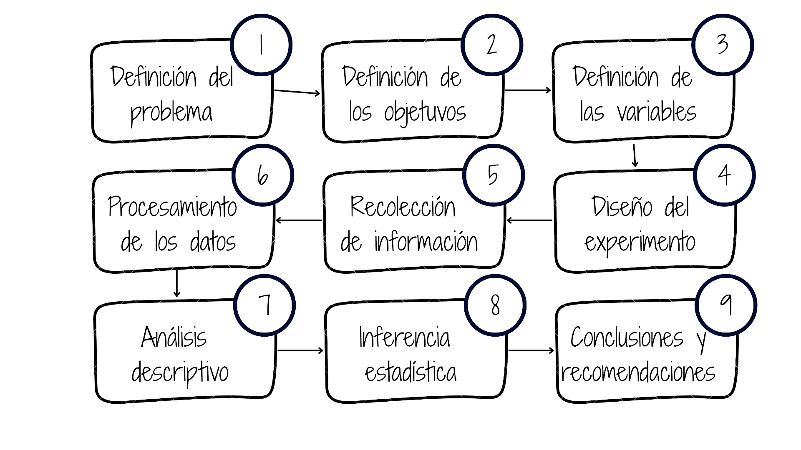

```{r setup, include=FALSE}
knitr::opts_chunk$set(
  echo = FALSE,
  warning = FALSE,
  message = FALSE,
  fig.align = "center",
  out.width = "90%"
)
```

# Un proceso, nueve etapas

<div class="method-map-wrap">
  
</div>

<div class="callout map-callout">Cada etapa determina la calidad de la siguiente.</div>

???
La metodología no es una lista de técnicas aisladas. Es una cadena de decisiones conectadas. Un error al comienzo puede afectar todo el estudio.

---

# 1–2. Problema y objetivos

<div class="two-cols">
  <div class="card light-1">
    <h3>Problema</h3>
    <p>Delimita qué ocurre, a quién afecta, dónde y cuándo.</p>
    <small>Se apoya en antecedentes, justificación y preguntas de investigación.</small>
  </div>
  <div class="card light-2">
    <h3>Objetivos</h3>
    <p>Expresan qué se pretende lograr.</p>
    <small>Usan verbos observables: describir, estimar, comparar o determinar.</small>
  </div>
</div>

<div class="example"><b>Ejemplo:</b> determinar los factores asociados con el aumento del tiempo de atención.</div>

???
El problema debe ser investigable y los objetivos verificables. La respuesta a los objetivos debe aportar directamente a la comprensión o solución del problema.

---

# 3. Variables de interés

<div class="flow">
  <div>Problema</div><b>→</b>
  <div>Objetivos</div><b>→</b>
  <div>Variables</div>
</div>

<div class="two-cols compact">
  <div class="card">
    <h3>Cualitativas</h3>
    <p>Categorías nominales u ordinales.</p>
    <small>Carrera, sede, satisfacción.</small>
  </div>
  <div class="card">
    <h3>Cuantitativas</h3>
    <p>Mediciones de intervalo o razón.</p>
    <small>Tiempo, edad, consumo.</small>
  </div>
</div>

???
Cada objetivo debe traducirse en información observable. La naturaleza y escala de las variables determinan qué gráficos, indicadores y análisis tienen sentido.

---

# 4. Diseño del estudio

<div class="three-cols">
  <div><span>A</span><b>Tipo de estudio</b><small>Experimental o no experimental</small></div>
  <div><span>B</span><b>Población</b><small>¿Sobre quién queremos concluir?</small></div>
  <div><span>C</span><b>Selección</b><small>Censo o muestra</small></div>
</div>

<div class="callout">El diseño establece el alcance de las conclusiones.</div>

???
Antes de recolectar debemos definir cómo obtendremos evidencia válida. El diseño depende de los objetivos, el contexto, el presupuesto, el tiempo y la precisión requerida.

---

# Población y muestra

<div class="population">
  <div class="population-ring">
    <b class="population-label">Población</b>
    <div class="sample-circle"><b>Muestra</b></div>
  </div>
  <div>
    <p><b>Población:</b> conjunto sobre el que deseamos inferir.</p>
    <p><b>Muestra:</b> subconjunto realmente observado.</p>
    <p><b>Unidad:</b> persona u objeto del que se obtiene información.</p>
    <p><b>Marco:</b> listado que permite seleccionar las unidades.</p>
    <div class="population-example"><b>Ejemplo:</b> población = 120 estudiantes; muestra = 30 estudiantes; unidad = cada estudiante; marco = lista de matriculados.</div>
  </div>
</div>

???
La muestra produce los datos, pero normalmente queremos responder preguntas sobre una población. Por ejemplo, si el curso tiene 120 estudiantes y seleccionamos 30, los 120 forman la población, los 30 la muestra, cada estudiante es una unidad y la lista de matriculados es el marco muestral.

---

# Estrategias de muestreo

<div class="sampling-types">
  <div class="sampling-card blue-bg">
    <h3>Probabilísticos</h3>
    <p>Cada unidad tiene una probabilidad conocida de selección.</p>
    <ul>
      <li>Aleatorio simple</li>
      <li>Estratificado</li>
      <li>Sistemático</li>
      <li>Por conglomerados</li>
    </ul>
  </div>
  <div class="sampling-card slate-bg">
    <h3>No probabilísticos</h3>
    <p>La selección depende del acceso o del criterio del investigador.</p>
    <ul>
      <li>Por conveniencia</li>
      <li>Por juicio o intencional</li>
      <li>Por cuotas</li>
      <li>Bola de nieve</li>
    </ul>
  </div>
</div>

<div class="callout compact-callout">El método de selección determina el alcance de las conclusiones.</div>

???
Los métodos probabilísticos permiten estimar el error muestral y sustentar inferencias sobre la población. Los no probabilísticos son útiles cuando no existe un marco muestral o se estudian poblaciones de difícil acceso, pero limitan la generalización.

---

class: section-slide, center, middle

# 5. Recolección de datos

## Obtener información válida, confiable y ética

???
Con el diseño definido comienza la recolección. Esta etapa convierte las variables planeadas en datos observados.

---

# Plan de recolección

<div class="three-cols collection">
  <div><span>1</span><b>Fuente de datos</b><small><strong>Primarios:</strong> encuesta, medición o experimento<br><strong>Secundarios:</strong> datos abiertos, registros administrativos o repositorios</small></div>
  <div><span>2</span><b>Protocolo</b><small>Quién, cómo, dónde y cuándo</small></div>
  <div><span>3</span><b>Control</b><small>Prueba piloto, capacitación y seguimiento</small></div>
</div>

<div class="callout">Verificar consentimiento o licencia, confidencialidad, calidad y trazabilidad.</div>

???
Los datos pueden ser primarios, cuando se recolectan para el estudio, o secundarios, cuando ya existen en portales de datos abiertos, registros administrativos o repositorios. En datos primarios se valida el instrumento con una prueba piloto; en datos secundarios se revisan la licencia, la fecha, la metodología, la cobertura y la calidad.

---

class: section-slide, center, middle

# 6. Procesamiento de datos

## Convertir registros en una base analizable

???
Los datos recolectados rara vez están listos para analizar. El procesamiento busca una base consistente, documentada y reproducible.

---

# Preparar la base

<div class="process">
  <div>Integrar</div><b>→</b>
  <div>Validar</div><b>→</b>
  <div>Limpiar</div><b>→</b>
  <div>Codificar</div><b>→</b>
  <div>Documentar</div>
</div>

- Detectar duplicados, valores imposibles y datos faltantes.
- Homogeneizar formatos, unidades y categorías.
- Conservar una copia de los datos originales.
- Crear un diccionario de variables y decisiones.

<div class="software-title">Software para el procesamiento</div>
<div class="software-grid">
  <div class="software featured"><b>R</b><small>Lenguaje estadístico</small></div>
  <div class="software featured"><b>RStudio</b><small>Entorno para R</small></div>
  <div class="software featured"><b>Positron</b><small>Entorno moderno de ciencia de datos</small></div>
  <div class="software alternatives"><b>Otras opciones</b><small>Python · Excel · SQL · SPSS · SAS · Stata</small></div>
</div>

???
Limpiar no significa modificar datos para que produzcan el resultado esperado. Cada corrección debe seguir reglas explícitas y quedar documentada. Para estas tareas destacamos R como lenguaje estadístico y RStudio o Positron como entornos de trabajo reproducible. También pueden utilizarse Python, Excel, SQL, SPSS, SAS o Stata.

---

class: section-slide, center, middle

# 7. Análisis descriptivo

## Comprender lo observado

???
El análisis descriptivo organiza, resume y visualiza los datos de la muestra o población observada.

---

# Describir antes de inferir

<div class="two-cols">
  <div class="card light-1">
    <h3>Tablas y gráficos</h3>
    <p>Frecuencias, barras, histogramas, cajas y dispersión.</p>
  </div>
  <div class="card light-2">
    <h3>Indicadores</h3>
    <p>Media, mediana, proporción, rango, varianza y desviación.</p>
  </div>
</div>

<div class="callout">Buscar patrones, diferencias, relaciones y valores atípicos.</div>

???
La técnica depende del objetivo y la escala de medición. Una buena descripción revela la estructura de los datos y ayuda a detectar errores antes de aplicar métodos inferenciales.

---

class: section-slide, center, middle

# 8. Inferencia estadística

## De la muestra a la población

???
La inferencia utiliza la información muestral para estimar características poblacionales y evaluar hipótesis, reconociendo la incertidumbre.

---

# Estimar y contrastar

<div class="two-cols">
  <div class="card">
    <h3>Estimación</h3>
    <p>Valores puntuales e intervalos de confianza.</p>
    <small>¿Cuál es el valor probable del parámetro?</small>
  </div>
  <div class="card">
    <h3>Pruebas de hipótesis</h3>
    <p>Evaluación de afirmaciones con evidencia muestral.</p>
    <small>¿Los datos son compatibles con la hipótesis?</small>
  </div>
</div>

<div class="callout">Reportar incertidumbre, supuestos y tamaño del efecto; no solo valores \(p\).</div>

???
La inferencia no elimina la incertidumbre: la cuantifica. Sus resultados dependen del diseño, el muestreo y el cumplimiento de los supuestos del método.

---

# 9. Conclusiones y recomendaciones

<div class="two-cols">
  <div class="card light-1">
    <h3>Conclusiones</h3>
    <p>Responden los objetivos con base en los resultados.</p>
    <small>Distinguen evidencia, interpretación y limitaciones.</small>
  </div>
  <div class="card light-2">
    <h3>Recomendaciones</h3>
    <p>Proponen acciones concretas y viables.</p>
    <small>Indican responsables, prioridades o nuevos estudios.</small>
  </div>
</div>

<div class="callout">No generalizar más allá de lo permitido por el diseño.</div>

???
Las conclusiones no repiten tablas: explican qué significan los resultados frente al problema. Las recomendaciones deben derivarse de esa evidencia y reconocer las limitaciones.

---

# Caso integrador

<div class="case">
  <div><span>Pregunta</span>¿Por qué aumentó el tiempo de atención?</div>
  <div><span>Datos</span>Tiempo, sede, demanda, personal y tipo de solicitud.</div>
  <div><span>Análisis</span>Describir tiempos y estimar asociaciones.</div>
  <div><span>Decisión</span>Priorizar sedes y procesos con mayor impacto.</div>
</div>

???
Este ejemplo resume el ciclo. La decisión final es defendible porque puede rastrearse desde el problema hasta los datos y el análisis.

---

# La cadena de coherencia

<div class="coherence">
Pregunta → Diseño → Datos → Análisis → Conclusión → Decisión
</div>

## Antes de terminar, verifique:

- Cada objetivo tiene variables y análisis asociados.
- La recolección y el procesamiento son trazables.
- Las conclusiones responden los objetivos.
- Las recomendaciones se apoyan en evidencia.

???
La coherencia es el principal criterio de calidad. Cada decisión debe poder justificarse con la etapa anterior.

---

class: final-slide, center, middle

# De una buena pregunta<br>a una decisión informada

<div class="title-rule"></div>

## Metodología Estadística

???
La metodología estadística produce valor cuando conecta preguntas relevantes, datos de calidad, análisis adecuados y decisiones responsables.


---

class: activity-slide

# Actividad 111

<div class="activity-kicker">Individual · Metodología estadística</div>

<div class="activity-layout">
  <div class="activity-task">
    <h3>¿Qué debes hacer?</h3>
    <ul>
      <li>Formular un problema para desarrollar durante el semestre.</li>
      <li>Definir sus objetivos y variables de interés.</li>
      <li>Identificar el tipo y la escala de medición de cada variable.</li>
      <li>Plantear recolección de información primaria o secundaria.</li>
    </ul>
  </div>
  <div class="activity-meta">
    <div><span>Entregable</span><b>actividad101.pdf</b></div>
    <div><span>Entrega</span><b>4 de agosto de 2026</b><small>23:59 · Plataforma BS</small></div>
  </div>
</div>

???
Como primera actividad, cada estudiante formulará un problema que pueda desarrollar durante el semestre. Debe definir objetivos, variables, tipos y escalas de medición, y considerar información primaria o secundaria. El archivo se entrega como actividad101.pdf el 4 de agosto a las 23:59.

---

class: activity-slide

# Actividad 112

<div class="activity-kicker">Individual · Base de datos</div>

<div class="activity-layout">
  <div class="activity-task">
    <h3>¿Qué debes hacer?</h3>
    <ul>
      <li>Buscar una base de datos de interés.</li>
      <li>Depurarla y documentarla cuando sea necesario.</li>
      <li>Construir su ficha técnica.</li>
    </ul>
    <p class="resource-line"><b>Recurso:</b> <a href="https://youtu.be/lRftK2mL3Sw">Cómo descargar datos abiertos</a></p>
  </div>
  <div class="activity-meta">
    <div><span>Entregable</span><b>actividad112.pdf</b><small>Ficha técnica · Excel · RStudio</small></div>
    <div><span>Entrega</span><b>4 de agosto de 2026</b><small>23:59 · Hora local</small></div>
  </div>
</div>

???
En la segunda actividad cada estudiante buscará una base de datos, la depurará y documentará, y construirá su ficha técnica. Puede apoyarse en el video sobre descarga de datos abiertos. El archivo actividad112.pdf se entrega el 4 de agosto a las 23:59.

---

class: activity-slide

# Actividad 113

<div class="activity-kicker">Individual · Instalación de software</div>

<div class="activity-layout">
  <div class="activity-task">
    <h3>Instala las herramientas del curso</h3>
    <div class="install-grid">
      <a href="https://cran.r-project.org/"><b>R</b><small>CRAN</small></a>
      <a href="https://rstudio.com/products/rstudio/download/"><b>RStudio</b><small>Descarga</small></a>
      <a href="https://positron.posit.co/"><b>Positron</b><small>Entorno de datos</small></a>
    </div>
    <p class="resource-line"><a href="https://www.youtube.com/watch?v=Nmu4WPdJBRo">Video para instalar R y RStudio</a></p>
  </div>
  <div class="activity-meta">
    <div><span>Resultado</span><b>R, RStudio y Positron instalados</b></div>
    <div><span>Fecha límite</span><b>5 de agosto de 2026</b><small>23:59 · Hora local</small></div>
  </div>
</div>

???
Finalmente, deben instalar R, RStudio y Positron, herramientas que utilizaremos en el curso. En la diapositiva encuentran enlaces directos de descarga y un video de apoyo. La fecha límite es el 5 de agosto a las 23:59.
