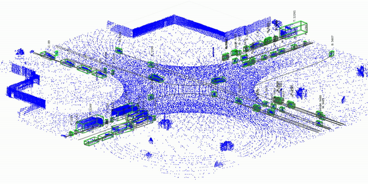

</br></br></br>

```{r, echo=FALSE, out.width="100%", fig.align = "left"}

```


```{r, echo=FALSE, out.width="100%", fig.align = "left"}

```


<br/><br/>

<div class="box5 with-label">
## Objetivo

Construir en grupos de **máximo tres estudiantes** un modelo sencillo que represente el comportamiento de un sistema o proceso de la Universidad mediante **variables aleatorias, distribuciones de probabilidad y simulación en R**.

El resultado final será un **tablero interactivo en Shiny** que permita modificar algunas condiciones del sistema y observar mediante simulación cómo cambia su comportamiento.

Para este proyecto entenderemos un **gemelo digital** como una representación simplificada de un sistema real que permite simular su funcionamiento bajo diferentes condiciones.

</div>

<br/><br/>

<div class="box5 with-label">
## Tema del proyecto

Cada grupo seleccionará un sistema o actividad relacionada con la Universidad.

Algunos ejemplos son:

- servicio de restaurante;
- ocupación de mesas;
- llegada de vehículos al parqueadero;
- disponibilidad de espacios de parqueo;
- ocupación de salas de estudio;
- uso de computadores;
- uso de espacios deportivos;
- servicio de caja;
- tiempos de espera en algún servicio universitario....

El grupo también podrá proponer otro sistema.

</div>

<br/><br/>

<div class="box5 with-label">
## Modelo probabilístico

El sistema deberá incluir **al menos cuatro variables aleatorias relevantes**.

Para cada variable se deberá indicar:

1. Qué representa.
2. Si es discreta o continua.
3. Qué distribución de probabilidad se utilizará.
4. Cuáles son sus parámetros.
5. Cómo se obtuvieron o estimaron esos parámetros.
6. Por qué la distribución seleccionada es apropiada.

Se podrán utilizar los modelos estudiados en el curso:

**Discretos:** binomial, Poisson, geométrica, hipergeométrica, binomial negativa...

**Continuos:** normal, uniforme, exponencial, gamma, beta,  Weibull...

Cuando sea pertinente, el proyecto deberá incorporar conceptos como **valor esperado, varianza, función de distribución acumulada, correlación o dependencia entre variables**.

</div>

<br/><br/>

<div class="box6 with-label">
## Ejemplo

Un grupo podría modelar el funcionamiento de una **cafetería universitaria**.

| Variable | Posible modelo |
|:---|:---|
| Número de estudiantes que llegan | Poisson |
| Tiempo entre llegadas | Exponencial |
| Tiempo de atención | Gamma |
| Compra o no de un producto | Bernoulli/Binomial |

El tablero podría permitir cambiar la cantidad promedio de estudiantes que llegan y observar cómo cambian el número de personas atendidas, el tiempo de espera o la congestión del sistema.

</div>

<br/><br/>


# Entregas

<br/><br/>

<div class="box5 with-label">
## Entrega 1. Tema y objetivo

**30 de septiembre**

###  <span style="color:#67C1A8">Informe 1 </span>

- integrantes del grupo;
- título del proyecto;
- sistema de la Universidad que se desea representar;
- breve descripción del sistema;
- objetivo general.

Esta entrega busca verificar que el tema sea apropiado y pueda desarrollarse durante el curso.

Entregable : archivo en formato pdf 

</div>

<br/><br/>

<div class="box5 with-label">
## Entrega 2. Descripción del sistema y modelo probabilístico

**21 de octubre**

### <span style="color:#67C1A8">Informe 2 </span> 


- descripción sencilla del funcionamiento del sistema;
- variables aleatorias que se utilizarán;
- distribuciones de probabilidad seleccionadas;
- parámetros de cada distribución;
- explicación de cómo se estimarán u obtendrán los parámetros;
- esquema sencillo de cómo funcionará la simulación.

Se recomienda utilizar una tabla como la siguiente:

| Variable | Descripción | Distribución | Parámetros |
|:---|:---|:---|:---|
| $X_1$ |  |  |  |
| $X_2$ |  |  |  |
| $X_3$ |  |  |  |
| $X_4$ |  |  |  |

</div>

<br/><br/> 

<div class="box5 with-label">
## Entrega 3. Presentación final y tablero Shiny

**12 de noviembre**

Cada grupo realizará una presentación oral y mostrará el funcionamiento de su simulación.


### <span style="color:#67C1A8">Presentación final</span>  

Debe incluir:

- problema y objetivo;
- descripción del sistema;
- variables aleatorias;
- distribuciones utilizadas;
- parámetros y forma de estimarlos;
- explicación de la simulación;
- principales resultados;
- conclusiones.

</div>

<br/><br/>

<div class="box5 with-label">
## Tablero Shiny

El tablero deberá permitir:

- modificar algunos parámetros del sistema;
- ejecutar o actualizar la simulación;
- presentar gráficamente los resultados;
- mostrar algunos indicadores importantes;
- comparar qué ocurre cuando cambian las condiciones del sistema.

El tablero debe ser **sencillo y funcional**. El objetivo principal no es desarrollar una aplicación compleja, sino utilizar la probabilidad y la simulación para representar el comportamiento del sistema.

</div>

<br/><br/>

<div class="box5 with-label">
## Recomendaciones

- Seleccionar un sistema sencillo.
- Utilizar distribuciones que tengan sentido para las variables estudiadas.
- No es necesario utilizar todas las distribuciones vistas en el curso.
- Los parámetros pueden obtenerse mediante observaciones, una muestra pequeña, información disponible o supuestos razonables.
- Todo supuesto utilizado debe explicarse.
- La simulación debe permitir experimentar con el sistema.
- Todos los integrantes deben participar en el desarrollo y conocer el funcionamiento del modelo.

</div>