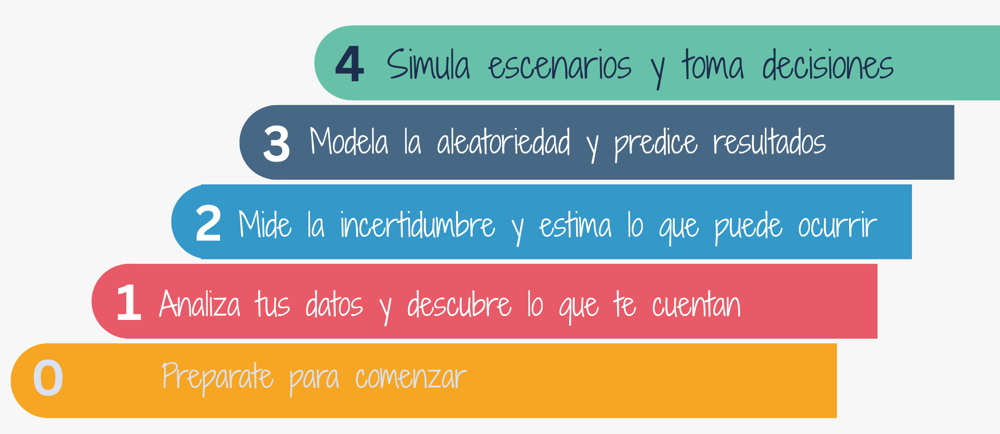
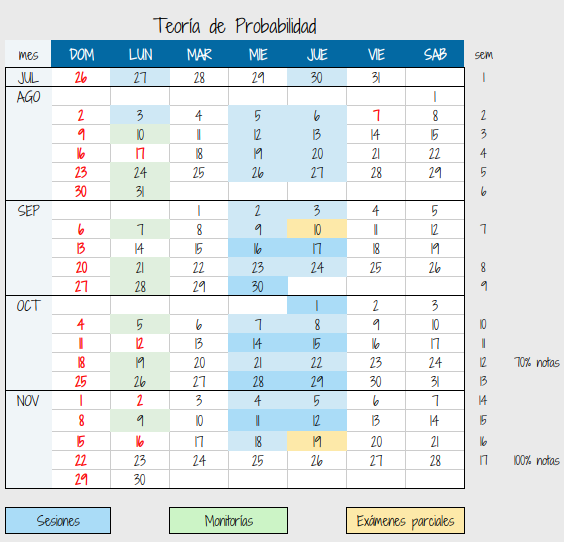
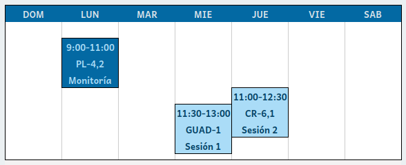
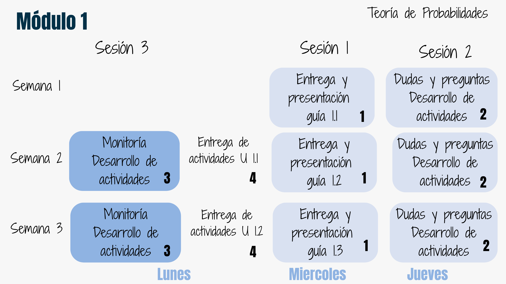
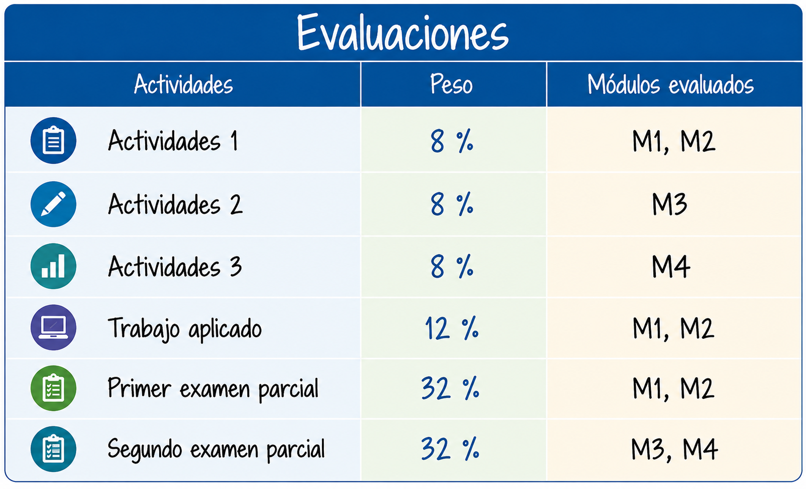
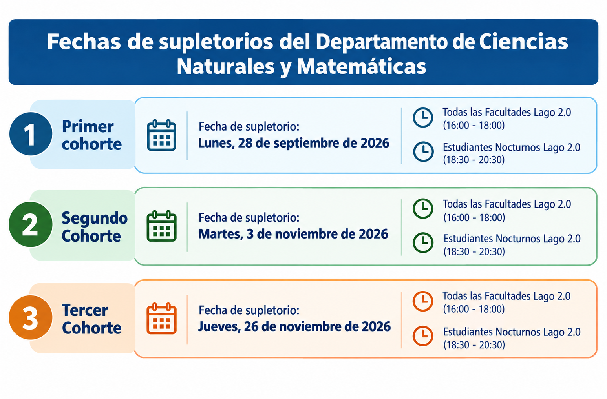
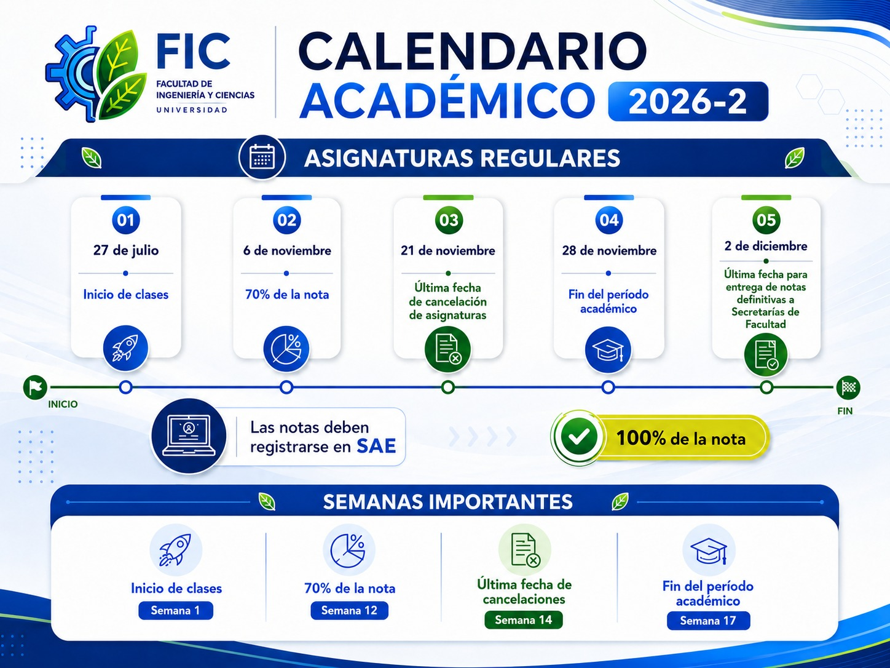

  

```{r setup, include=FALSE}
knitr::opts_chunk$set(echo = TRUE, comment = NA)
# colores
source("R/colores.R")
```


```{r, echo=FALSE, out.width="100%", fig.align = "center"}

```


<br/><br/>

<div class="box6 with-label">
## Módulos


```{r, echo=FALSE, out.width="70%", fig.align = "center"}

```
</div>

<br/><br/>

<div class="box6 with-label">
## Cronograma

```{r, echo=FALSE, out.width="70%", fig.align = "center"}

```
</div>

<br/><br/>

<div class="box6 with-label">
## Salones de clase

```{r, echo=FALSE, out.width="70%", fig.align = "center"}
 
```
</div>

<br/><br/>

<div class="box6 with-label">
## Metodología

```{r, echo=FALSE, out.width="70%", fig.align = "center"}

```
</div>

<br/><br/>

La metodología del curso esta compuesta por 4 momentos:

<br/>

##### 1. Sesión 1. 

Presentación y entrega de la guia de aprendizaje - sesión 1. Previamente a esta sesiñon estará dispuesta la información correspondiente a la unidad todo el material : guía, recursos, código, actividades, los cuales deben ser revisados previamente a la primera sesión.

<br/>

##### 2. Sesión 2. 

Dudas y preguntas - desarrollo de actividades. Durante esta sesión los estudiantes continuan con el desarrollo de las actividades planteadas y podrán realizar preguntas e interrogantes que surja, ya se en el desarrollo de las actividades planteadas o de los temas abordados.

<br/>

#####  3. Sesión 3.

Monitoria. En esta sesión se continua con el desarrollo de las actividades planteadas con el acompañamiento del monitor del curso.

<br/>

#### 4. Entrega. 

Por último las actividades deben se entregadas en la plataforma de acuerdo en las indicaciones dadas en la guía de aprendizaje correspondiente.

<br/><br/>

<div class="box6 with-label">
## Evaluaciones

```{r, echo=FALSE, out.width="50%", fig.align = "center"}

```
</div>

<br/><br/>

#### Profesor : Daniel Enrique González

correo : dgonzalez@javerianacali.edu.co

#### Monitor : Jeison David de Vuijst

<br/><br/>

<div class="box6 with-label">
## Atención estudiantes

```{r, echo=FALSE, out.width="100%", fig.align = "center"}
knitr::include_graphics("img/atencion.png")
```
</div>

<br/><br/>

<div class="box6 with-label">
## Supletorios


```{r, echo=FALSE, out.width="70%", fig.align = "center"}

```
</div>


<br/><br/>

<div class="box6 with-label">
## Atención estudiantes

```{r, echo=FALSE, out.width="100%", fig.align = "center"}
knitr::include_graphics("img/atencion.png")
```
</div>


<br/><br/>

<div class="box6 with-label">
## Calendario académico 2026-2 PUJCL

```{r, echo=FALSE, out.width="100%", fig.align = "center"}

```
</div>


 
 
