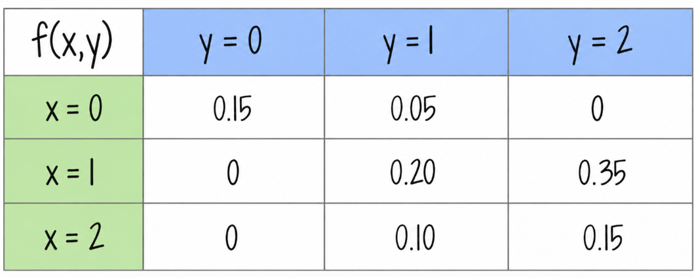

```{r setup, include=FALSE}
knitr::opts_chunk$set(echo = TRUE, message = FALSE, warning = FALSE, comment = NA)
library(psych)
library(summarytools)

# install.packages("devtools")
#devtools::install_github("dgonxalex80/paquete018")
#library(paquete018)


# colores
source("R/init.R")

```


```{r, echo=FALSE, out.width="100%", fig.align = "center"}

```


<br/><br/>

# Unidad 3.1

<br/>

<br/><br/>

<div class="box4 with-label">
### Problema 1.1 

Clasifique las siguientes variables aleatorias como discretas o continuas:

* $X$ : el número de accidentes automovilísticos que ocurren al año en una ciudad determinada
* $Y$ : el tiempo que dura un partido de futbol - tiempo real de juego en minutos-
* $M$ : la cantidad de leche que una vaca determinada produce anualmente
* $N$ : el número de huevos que una gallina pone mensualmente
* $P$ : el número de permisos para construcción que los funcionarios de una  ciudad emiten cada mes
* $Q$ : el peso del grano maiz producido por hectarea
* $R$ : la edad de un estudiante que ingresa a la universidad
* $S$ : el número de zapatos que tiene un adolescente 
* $T$ : el número de crias que tiene una tortuga
* $U$ : el consumo mensual de energía de un hogar en Cali
* $V$ : el número de hijos por hagar en Colombia
* $W$ : el número de pasajeros de un bus de servicio publico MIO
* $X$ : el gasto diario de un estudiante universitario de la Javeriana Cali
* $Y$ : la cantidad de calorías que un adulto  con actividad moderada gasta diariamente
* $Z$ : la utilidad mensual de una microempresa
</div>

<br/><br/>


<div class="box4 with-label">
### Problema 1.2 

El tiempo que pasa, en horas, para que un radar detecte entre conductores sucesivos a los que exceden los límites de velocidad es una variable aleatoria continua con una  función de distribución acumulada:

$$F_{_{X}}(x) = \left \{ 
				\begin{matrix} 
				 0  & \mbox{ , }	x \leq 0\\ 
				 1-exp\{-8x \}  & x \geq 0 
				\end{matrix}\right.  
				$$
				
Calcule la probabilidad de que el tiempo que  pase para que el radar detecte entre conductores sucesivos a  los que exceden los límites de velocidad sea menor a 12 minutos

* usando la función de distribución de probabilidad acumulada de $X$
* utilizando la función de densidad de probabilidad de $X$
* Represente las función $f(x)$ gráficamente

</div>

<!-- <details> -->
<!-- <summary><b>respuesta</b></summary> -->

Primero se convierten los minutos a horas: $12/60=0.2$ horas.

* **Con la acumulada:** $P(X<0.2)=F_X(0.2)=1-e^{-8(0.2)}=1-e^{-1.6}\approx0.798103$.
* **Con la densidad:** al derivar la acumulada se obtiene

$$
f_X(x)=\begin{cases}8e^{-8x},&x>0,\\0,&x<0.\end{cases}
$$

El valor de la densidad en $x=0$ no afecta las probabilidades. Por tanto,

$$P(X<0.2)=\int_0^{0.2}8e^{-8x}\,dx=[-e^{-8x}]_0^{0.2}\approx0.798103.$$

La probabilidad es aproximadamente **79.81%**.

```{r respuesta-1-2, fig.align='center', fig.width=6, fig.height=4}
curve(dexp(x, rate = 8), from = 0, to = 1, col = c31, lwd = 2,
      xlab = "Tiempo (horas)", ylab = "f(x)", main = "Densidad exponencial")
abline(v = 0.2, lty = 2, col = c21)
```

<!-- </details> -->


<br/><br/>


<div class="box4 with-label">
### Problema 1.3

Una variable aleatoria continua $X$, que puede tomar valores entre $x=2$ y $x=5$, tiene una función de densidad data por: 

$$
f_X(x)=
\begin{cases}
\dfrac{2(1+x)}{27}, & 2\leq x\leq 5, \\[6pt]
0, & \text{en otro caso}.
\end{cases}
$$

 Calcule: 

* $P(X < 4)$
* $P(3 \leq X < 4)$
* Represente la función $f(x)$ gráficamente
 
 </div>

<!-- <details> -->
<!-- <summary><b>respuesta</b></summary> -->

<!-- Una primitiva de la densidad en su soporte es $(2x+x^2)/27$. -->

<!-- * $P(X<4)=\displaystyle\int_2^4\frac{2(1+x)}{27}\,dx=\frac{24-8}{27}=\frac{16}{27}\approx0.592593$. -->
<!-- * $P(3\leq X<4)=\displaystyle\int_3^4\frac{2(1+x)}{27}\,dx=\frac{24-15}{27}=\frac13\approx0.333333$. -->

<!-- ```{r respuesta-1-3, fig.align='center', fig.width=6, fig.height=4} -->
<!-- curve(2 * (1 + x) / 27, from = 2, to = 5, xlim = c(1, 6), -->
<!--       ylim = c(0, 0.5), col = c31, lwd = 2, xlab = "x", ylab = "f(x)") -->
<!-- segments(c(1, 5), 0, c(2, 6), 0, col = c31, lwd = 2) -->
<!-- ``` -->

<!-- </details> -->

 
 <br/><br/>
 
<div class="box4 with-label">
### Problema 1.4

Suponga que cierto tipo de pequeñas empresas de procesamiento de datos están tan especializadas que algunas tienen dificultades para obtener utilidades durante su primer año de operación. La función de densidad de probabilidad está dada por:
 
 $$f_{_{Y}}(y) = \left \{ 
				\begin{matrix} 
				ky^4 (1-y)^3 & \mbox{ , }	0 \leq y \leq 1\\ 
				0  & \mbox{en otro caso }
				\end{matrix}\right.  
				$$
 
 
* ¿Cuál es el valor de $k$ que hace de la anterior una función de densidad de probabilidad válida?
* Calcule la probabilidad de que al menos 50% de las empresas tengan utilidades durante el primer año
* Calcule la probabilidad de que al menos el 80% de las empresas tengan utilidad durante el primer año
* Represente la función $f(x)$ gráficamente

</div>

<!-- <details> -->
<!-- <summary><b>respuesta</b></summary> -->

<!-- Se interpreta $Y$ como la proporción de empresas que obtienen utilidades. -->

<!-- * Para normalizar la densidad: -->

<!-- $$1=k\int_0^1 y^4(1-y)^3\,dy -->
<!-- =k\left(\frac15-\frac36+\frac37-\frac18\right)=\frac{k}{280}, -->
<!-- \qquad k=280.$$ -->

<!-- * $P(Y\geq0.5)=\displaystyle280\int_{0.5}^1 y^4(1-y)^3\,dy=0.63671875$, aproximadamente **63.67%**. -->
<!-- * $P(Y\geq0.8)=\displaystyle280\int_{0.8}^1 y^4(1-y)^3\,dy=0.0562816$, aproximadamente **5.63%**. -->

<!-- Estas integrales se evalúan con la primitiva $280(y^5/5-y^6/2+3y^7/7-y^8/8)$. También se reconoce una distribución beta con parámetros $5$ y $4$. -->

<!-- ```{r respuesta-1-4, fig.align='center', fig.width=6, fig.height=4} -->
<!-- curve(dbeta(x, shape1 = 5, shape2 = 4), from = 0, to = 1, -->
<!--       col = c31, lwd = 2, xlab = "Proporción de empresas", ylab = "f(y)") -->
<!-- ``` -->

<!-- </details> -->


 <br/><br/>

<div class="box4 with-label">
### Problema1.5 
 
En un grupo de 10 estudiantes que participan en un proyecto universitario, 5 pertenecen a Ingeniería Industrial, 2 a Finanzas y 3 a Administración de Empresas. Para conformar un equipo de trabajo se seleccionan aleatoriamente 4 estudiantes, sin reemplazo.

Sea $X$ el número de estudiantes de Ingeniería Industrial seleccionados. Determine la función de probabilidad de $X$ y explique sus resultados utilizando una fórmula apropiada.
 
</div>

<!-- <details> -->
<!-- <summary><b>respuesta</b></summary> -->

<!-- Como la selección es sin reemplazo, $X$ tiene distribución hipergeométrica. Hay $\binom{10}{4}=210$ equipos igualmente probables. Para obtener $x$ estudiantes de Ingeniería se eligen $x$ de los $5$ de Ingeniería y $4-x$ de los otros $5$: -->

<!-- $$P(X=x)=\frac{\binom{5}{x}\binom{5}{4-x}}{\binom{10}{4}},\qquad x=0,1,2,3,4,$$ -->

<!-- y la probabilidad es cero para los demás valores. -->

<!-- | $x$ | 0 | 1 | 2 | 3 | 4 | -->
<!-- |:---:|:---:|:---:|:---:|:---:|:---:| -->
<!-- | $P(X=x)$ | $1/42$ | $5/21$ | $10/21$ | $5/21$ | $1/42$ | -->

<!-- Las probabilidades suman $1$. El resultado más probable es seleccionar dos estudiantes de Ingeniería, con probabilidad $10/21\approx0.476190$. -->

<!-- </details> -->

 
<br/><br/>

<div class="box4 with-label">
### Problema 1.6 

En una cafetería universitaria hay 6 pedidos listos para entregar: 4 tienen un tiempo estimado de entrega de 10 minutos cada uno y 2 de 5 minutos cada uno. Un domiciliario selecciona aleatoriamente 3 pedidos, sin reemplazo, para realizar su siguiente recorrido.

Sea $T$ la suma de los tiempos estimados de entrega de los tres pedidos seleccionados.

Determine la función de probabilidad de $T$ y represente gráficamente la distribución obtenida.   

</div>

<!-- <details> -->
<!-- <summary><b>respuesta</b></summary> -->

<!-- Sea $K$ el número de pedidos de 10 minutos seleccionados. Entonces $T=10K+5(3-K)=15+5K$. Como solo hay dos pedidos de 5 minutos, $K\in\{1,2,3\}$. -->

<!-- $$P(K=k)=\frac{\binom4k\binom2{3-k}}{\binom63},\qquad \binom63=20.$$ -->

<!-- | $k$ | $t$ (minutos) | $P(T=t)$ | -->
<!-- |:---:|:---:|:---:| -->
<!-- | 1 | 20 | $4/20=0.2$ | -->
<!-- | 2 | 25 | $12/20=0.6$ | -->
<!-- | 3 | 30 | $4/20=0.2$ | -->

<!-- Para cualquier otro valor de $t$, $P(T=t)=0$. -->

<!-- ```{r respuesta-1-6, fig.align='center', fig.width=6, fig.height=4} -->
<!-- tiempos <- c(20, 25, 30) -->
<!-- probabilidades <- dhyper(1:3, m = 4, n = 2, k = 3) -->
<!-- plot(tiempos, probabilidades, type = "h", lwd = 3, col = c31, -->
<!--      ylim = c(0, 0.7), xaxt = "n", xlab = "T (minutos)", ylab = "P(T = t)") -->
<!-- axis(1, at = tiempos) -->
<!-- points(tiempos, probabilidades, pch = 19, col = c31) -->
<!-- ``` -->

<!-- </details> -->


<br/><br/>


<div class="box4 with-label">
### Problema 1.7

Con base en las pruebas extensas, el fabricante de una lavadora determinó que el tiempo $Y$ (en años) para que el electrodoméstico requiera una reparación mayor se obtiene mediante la siguiente función de densidad de probabilidad :

 
  $$f_{_{Y}}(y) = \left \{ 
				\begin{matrix} 
				\dfrac{1}{4} exp\{-y/4\} & \mbox{ , }	y \geq 0\\ 
				0  & \mbox{en otro caso }
				\end{matrix}\right.  
				$$
 
* Los críticos considerarían que la lavadora es una ganga si no hay una probabilidad de que requiera una reparación mayor antes del sexto año. ¿Se puede considerar la lavadora como una ganga?

* ¿Cuál es la probabilidad de que a lavadora requiera una reparación mayor durante el primer año?
* Represente la función $f(x)$ gráficamente
  
</div>

<!-- <details> -->
<!-- <summary><b>respuesta</b></summary> -->

<!-- La acumulada es $F_Y(y)=1-e^{-y/4}$ para $y\geq0$. -->

<!-- * $P(Y<6)=1-e^{-6/4}\approx0.776870$. Según el criterio literal del enunciado (probabilidad nula de reparación antes del sexto año), **no es una ganga**: la probabilidad de requerirla es aproximadamente **77.69%**. La probabilidad de llegar al sexto año sin esa reparación es $e^{-1.5}\approx0.223130$. -->
<!-- * $P(Y<1)=1-e^{-1/4}\approx0.221199$, aproximadamente **22.12%**. -->

<!-- ```{r respuesta-1-7, fig.align='center', fig.width=6, fig.height=4} -->
<!-- curve(dexp(x, rate = 1/4), from = 0, to = 20, col = c31, lwd = 2, -->
<!--       xlab = "Tiempo (años)", ylab = "f(y)") -->
<!-- ``` -->

<!-- </details> -->


<br/><br/>

<div class="box4 with-label">
### Problema 1.8

Sea el número de llamadas telefónicas que recibe un conmutador durante un intervalo de 5 minutos una variable aleatoria $X$ con la siguiente función de distribución de probabilidad:

<br/>

$$
f_X(x)=
\begin{cases}
\dfrac{e^{-2}2^x}{x!}, & x=0,1,2,3,\ldots, \\[6pt]
0, & \text{en otro caso}.
\end{cases}
$$

<br/>

* Determine la probabilidad de que $X$ sea igual a $0, 1, 2, 3, 4, 5$ y $6$
* Grafique la función de distribución de probabilidad para estos valores de $X$
* Determine la función de distribución acumulada para estos valores de $X$.
* Represente la función $f(x)$ gráficamente

</div>

<!-- <details> -->
<!-- <summary><b>respuesta</b></summary> -->

<!-- La variable tiene distribución Poisson con parámetro $\lambda=2$. -->

<!-- | $x$ | $P(X=x)$ | $F_X(x)=P(X\leq x)$ | -->
<!-- |:---:|:---:|:---:| -->
<!-- | 0 | 0.135335 | 0.135335 | -->
<!-- | 1 | 0.270671 | 0.406006 | -->
<!-- | 2 | 0.270671 | 0.676676 | -->
<!-- | 3 | 0.180447 | 0.857123 | -->
<!-- | 4 | 0.090224 | 0.947347 | -->
<!-- | 5 | 0.036089 | 0.983436 | -->
<!-- | 6 | 0.012030 | 0.995466 | -->

<!-- En general, -->

<!-- $$F_X(x)=\begin{cases}0,&x<0,\\ -->
<!-- e^{-2}\displaystyle\sum_{j=0}^{\lfloor x\rfloor}\frac{2^j}{j!},&x\geq0. -->
<!-- \end{cases}$$ -->

<!-- La acumulada es constante entre enteros y tiene saltos en ellos. Los valores de $0$ a $6$ no agotan el soporte: $P(X>6)\approx0.004534$. -->

<!-- ```{r respuesta-1-8, fig.align='center', fig.width=7, fig.height=4} -->
<!-- x <- 0:6 -->
<!-- plot(x, dpois(x, lambda = 2), type = "h", lwd = 3, col = c31, -->
<!--      ylim = c(0, 0.3), xlab = "Número de llamadas", ylab = "P(X = x)") -->
<!-- points(x, dpois(x, lambda = 2), pch = 19, col = c31) -->
<!-- plot(c(-1, x, 7), c(0, ppois(x, 2), ppois(7, 2)), type = "s", -->
<!--      col = c31, lwd = 2, xlim = c(-1, 6.8), ylim = c(0, 1), -->
<!--      xlab = "x", ylab = "F(x)") -->
<!-- points(x, ppois(x, 2), pch = 19, col = c31) -->
<!-- points(x, ppois(x - 1, 2), pch = 21, bg = "white", col = c31) -->
<!-- ``` -->

<!-- </details> -->


<br/><br/>

<div class="box4 with-label">
### Problema 1.9 

El congestionamiento de pasajeros es un problema de servicio en los aeropuertos, en los cuales se instalan trenes para reducir la congestión.  cuando se usa el tren el tiempo $X$, en minutos, que toma viajar desde la terminal principal hasta una  explanada específica tiene la siguiente función de densidad:


 $$f_{_{X}}(x) = \left \{ 
				\begin{matrix} 
				\dfrac{1}{10} & \mbox{ , }	0 \leq y \leq 10\\ 
				0  & \mbox{en otro caso }
				\end{matrix}\right.  
				$$

* Determine que la función de  densidad de probabilidad anterior es válida
* Calcule la probabilidad de que el tiempo que le toma a un pasajero viajar desde la terminal principal hasta la explanada no exceda los 7 minutos
* Represente la función $f(x)$ gráficamente

</div>

<!-- <details> -->
<!-- <summary><b>respuesta</b></summary> -->

<!-- En el soporte del enunciado se entiende $0\leq x\leq10$ (la letra $y$ es un error de notación). -->

<!-- * La densidad es no negativa y $\displaystyle\int_{-\infty}^{\infty}f_X(x)\,dx=\int_0^{10}\frac1{10}\,dx=1$; por tanto, es válida. -->
<!-- * $P(X\leq7)=\displaystyle\int_0^7\frac1{10}\,dx=\frac7{10}=0.7$, es decir, **70%**. -->

<!-- ```{r respuesta-1-9, fig.align='center', fig.width=6, fig.height=4} -->
<!-- plot(NA, xlim = c(-2, 12), ylim = c(0, 0.12), -->
<!--      xlab = "Tiempo (minutos)", ylab = "f(x)") -->
<!-- segments(c(-2, 0, 10), c(0, 0.1, 0), c(0, 10, 12), c(0, 0.1, 0), -->
<!--          col = c31, lwd = 2) -->
<!-- points(c(0, 10), c(0.1, 0.1), pch = 19, col = c31) -->
<!-- points(c(0, 10), c(0, 0), pch = 21, bg = "white", col = c31) -->
<!-- ``` -->

<!-- </details> -->


<br/>

Problemas tomado de walpole (2006)

<br/><br/><br/>


<div class="box4 with-label">
### Problema 1.10

Suponga que:

$$
f_X(x)=
\begin{cases}
e^{-x}, & x\geq 0, \\[4pt]
0, & x<0.
\end{cases}
$$

Determine :

* $P(1 < X)$
* $P(1 < X < 2.5$
* $P(X = 3$
* $P(X < 4)$
* Los valores de $Me$, $Q_{1}$ y $Q_{3}$

</div>

<!-- <details> -->
<!-- <summary><b>respuesta</b></summary> -->

<!-- Para $x\geq0$, $F_X(x)=1-e^{-x}$. -->

<!-- * $P(1<X)=e^{-1}\approx0.367879$. -->
<!-- * $P(1<X<2.5)=e^{-1}-e^{-2.5}\approx0.285794$. -->
<!-- * $P(X=3)=0$, porque $X$ es continua. -->
<!-- * $P(X<4)=1-e^{-4}\approx0.981684$. -->

<!-- El cuantil de orden $p$ satisface $1-e^{-q_p}=p$, de donde $q_p=-\ln(1-p)$. -->

<!-- * $Me=q_{0.5}=\ln2\approx0.693147$. -->
<!-- * $Q_1=q_{0.25}=-\ln(0.75)\approx0.287682$. -->
<!-- * $Q_3=q_{0.75}=-\ln(0.25)\approx1.386294$. -->

<!-- </details> -->


<br/><br/>


<div class="box4 with-label">
### Problema 1.11

Para una variable aleatoria con función de densidad :  

$$
f_X(x)=
\begin{cases}
\dfrac{x}{8}, & 3<x<5, \\[4pt]
0, & \text{en otro caso}.
\end{cases}
$$

Determine :

* $P(X < 4)$
* $P(X > 3.5)$
* $P(4 < X < 5)$
* $P((X < 3.5) \cup (X > 4.5))$
* el valor de $Me$

</div>

<!-- <details> -->
<!-- <summary><b>respuesta</b></summary> -->

<!-- Al integrar la densidad se obtiene -->

<!-- $$F_X(x)=\begin{cases}0,&x\leq3,\\(x^2-9)/16,&3<x<5,\\1,&x\geq5.\end{cases}$$ -->

<!-- * $P(X<4)=(16-9)/16=7/16=0.4375$. -->
<!-- * $P(X>3.5)=(25-3.5^2)/16=51/64=0.796875$. -->
<!-- * $P(4<X<5)=(25-16)/16=9/16=0.5625$. -->
<!-- * Los eventos de la unión son disjuntos, así que $P((X<3.5)\cup(X>4.5))=(3.5^2-9)/16+(25-4.5^2)/16=1/2$. -->
<!-- * La mediana satisface $(Me^2-9)/16=1/2$, por lo que $Me=\sqrt{17}\approx4.123106$. -->

<!-- </details> -->


<br/><br/>

<div class="box4 with-label">
### Problema 1.12 

Suponga que $X$ tiene una función de distribución acumulada :

$$F_{_{X}}(x) = \left \{ 
				\begin{matrix} 
				 0    & \mbox{ , } x \leq 0\\ 
				 2x   & \mbox{, } x < 0 < x 5  \\
				 1    & \mbox{ , } 5 \leq 5
				\end{matrix}\right.  
				$$

Determine:

* $P(X < 4)$
* $P(X = 1.5)$
* $P(X > 3)$
* $P(0.5 < X < 2.7$

</div>

<!-- <details> -->
<!-- <summary><b>respuesta</b></summary> -->

<!-- **Nota sobre el enunciado:** la expresión escrita no define una acumulada válida: $2x$ supera $1$ en parte del intervalo hasta $5$ y las condiciones de los tramos están mal transcritas. Para resolver se supone que la intención era $F_X(x)=0.2x=x/5$ en $0<x<5$, como en los problemas 1.16 y 1.20: -->

<!-- $$F_X(x)=\begin{cases}0,&x\leq0,\\x/5,&0<x<5,\\1,&x\geq5.\end{cases}$$ -->

<!-- **Bajo esta interpretación:** -->

<!-- * $P(X<4)=4/5=0.8$. -->
<!-- * $P(X=1.5)=0$, porque la distribución es continua. -->
<!-- * $P(X>3)=1-3/5=0.4$. -->
<!-- * $P(0.5<X<2.7)=(2.7-0.5)/5=0.44$. -->

<!-- Los resultados quedan sujetos a esta corrección; la fórmula original no permite obtener probabilidades válidas. -->

<!-- </details> -->


<br/><br/>


<div class="box4 with-label">
### Problema 1.13

Para la variable aleatoria que tiene la siguiente función de distribución de probabilidad :

| $x$  | $-2$ | $-1$   | $0$    |  $1$   | $2$    |
|:----:|:----:|:------:|:------:|:------:|:------:|
|$f(x)$|$1/8$ |$2/8$   |$2/8$   |$2/8$   | $1/8$  |

Determine:

* $P(X \leq 2)$
* $P(X > 3)$
* $P(-1 \leq X \leq 1)$
* $P(X < 3.5 ; X > 4.5)$
* El valor de $Me$

</div>

<!-- <details> -->
<!-- <summary><b>respuesta</b></summary> -->

<!-- * $P(X\leq2)=1$, pues todos los valores del soporte son menores o iguales a $2$. -->
<!-- * $P(X>3)=0$. -->
<!-- * $P(-1\leq X\leq1)=2/8+2/8+2/8=3/4=0.75$. -->
<!-- * Interpretando el punto y coma como intersección, $P((X<3.5)\cap(X>4.5))=0$, pues no se pueden cumplir ambas condiciones. Si se pretendía una unión, la probabilidad sería $1$, ya que siempre $X<3.5$. -->
<!-- * $Me=0$: $F_X(-1)=3/8<1/2$ y $F_X(0)=5/8\geq1/2$. -->

<!-- </details> -->


<br/><br/>

<div class="box4 with-label">
### Problema 1.14

Para una variable con función de distribución de probabilidad : 

 $$f_{_{X}}(x) = \left \{ 
				\begin{matrix} 
				\dfrac{2x + 1}{25} & \mbox{ , }	x=0, 1, 2, 3, 4\\ 
				0  & \mbox{en otro caso }
				\end{matrix}\right.  
				$$

Determine:

* $P(X =1)$
* $P(X \leq 1)$
* $P(2 \leq X < 4)$

</div>

<!-- <details> -->
<!-- <summary><b>respuesta</b></summary> -->

<!-- * $P(X=1)=(2\cdot1+1)/25=3/25=0.12$. -->
<!-- * $P(X\leq1)=(1+3)/25=4/25=0.16$. -->
<!-- * $P(2\leq X<4)=P(X=2)+P(X=3)=(5+7)/25=12/25=0.48$. -->

<!-- </details> -->


<br/><br/>

<div class="box4 with-label">
### Problema 1.15 

Para una variable aleatoria con función de distribución de probabilidad: 

$$
f_X(x)=
\begin{cases}
\dfrac{3}{4}\left(\dfrac{1}{4}\right)^x,
& x=0,1,2,3,\ldots, \\[6pt]
0, & \text{en otro caso}.
\end{cases}
$$

* $P(X = 2)$
* $P(X \leq 2)$
* $P(2 \leq X$

</div>

<!-- <details> -->
<!-- <summary><b>respuesta</b></summary> -->

<!-- Es una distribución geométrica que cuenta fallos antes del primer éxito, con $p=3/4$ y $1-p=1/4$. -->

<!-- * $P(X=2)=\frac34(\frac14)^2=3/64=0.046875$. -->
<!-- * $P(X\leq2)=\frac34[1+\frac14+(\frac14)^2]=63/64=0.984375$. -->
<!-- * $P(2\leq X)=1-P(X\leq1)=(\frac14)^2=1/16=0.0625$. -->

<!-- </details> -->


<br/><br/>

<div class="box4 with-label">
### Problema 1.16 

Sponga que $X$ tiene una función de probabilidad acumulada: 

$$F_{_{X}}(x) = \left \{ 
				\begin{matrix} 
				 0    & \mbox{ , } x \leq 0\\ 
				 0.2 x   & \mbox{, } 0 < x < 5  \\
				 1    & \mbox{ , } x \geq 5
				\end{matrix}\right.  
				$$

Determine: 
* $P(X < 2.8)$


* $P(X > 1.5)$
* $P(X < -2)$
* Determine $f_{_{X}}(x)$

</div>

<!-- <details> -->
<!-- <summary><b>respuesta</b></summary> -->

<!-- * $P(X<2.8)=F_X(2.8)=0.2(2.8)=0.56$. -->
<!-- * $P(X>1.5)=1-F_X(1.5)=1-0.2(1.5)=0.7$. -->
<!-- * $P(X<-2)=0$, porque $X$ solo toma valores entre $0$ y $5$. -->
<!-- * Derivando la acumulada se obtiene una densidad uniforme: -->

<!-- $$f_X(x)=\begin{cases}0.2,&0<x<5,\\0,&\text{en otro caso}.\end{cases}$$ -->

<!-- ```{r respuesta-1-16} -->
<!-- Fx <- function(x) pmin(1, pmax(0, 0.2 * x)) -->
<!-- Fx(2.8) -->
<!-- ``` -->

<!-- </details> -->


<br/><br/>

<div class="box4 with-label">
### Problema 1.17 

El tiempo de reparación (en minutos) de una máquina fotocopiadora tiene una función de densidad:


 $$f_{_{X}}(x) = \left \{ 
				\begin{matrix} 
				\dfrac{1}{22} exp\{-x/22\} & \mbox{ , }	x > 0\\ 
				0  & \mbox{en otro caso }
				\end{matrix}\right.  
				$$

Cuando el profesor de Probabilidad y Estadística se preparaba para imprimir el cuestionario del segundo examen parcial, fue enterado por la secretaria del departamento que la máquina fotocopiadora se había averiado y que el técnico había acabado de llegar en ese instante y empezado a repararla. El profesor debe contar con por lo menos 10 minutos extras - tiempo de fotocopiado de 35 exámenes, organizar sus respectivas hojas de respuestas, sumado tiempo de su desplazamiento hasta el salón de clase, arreglo de las mesas y entrega de los cuestionarios a los estudiantes. Al mirar el reloj, el profesor observa que faltan 20 minutos para la hora en que debe empezar el examen y decide esperar a que el técnico repare la fotocopiadora. ¿Es acertada o no la decisión que tomó el profesor? Justifique su respuesta.   

</div>

<!-- <details> -->
<!-- <summary><b>respuesta</b></summary> -->

<!-- Para empezar a tiempo, la reparación debe terminar en los $20-10=10$ minutos disponibles. Como $X$ es exponencial con media de $22$ minutos, -->

<!-- $$P(X\leq10)=\int_0^{10}\frac1{22}e^{-x/22}\,dx -->
<!-- =1-e^{-10/22}\approx0.365264.$$ -->

<!-- La probabilidad de retrasarse es $P(X>10)=e^{-10/22}\approx0.634736$, aproximadamente **63.47%**. -->

<!-- Si el criterio es tener una probabilidad alta de iniciar puntualmente, **no es una decisión acertada**: solo tiene alrededor de **36.53%** de probabilidad de lograrlo. Una decisión óptima en términos de costos también dependería de las alternativas disponibles y de las consecuencias del retraso, que no se especifican. -->

<!-- </details> -->


<!-- ```{r, echo=FALSE} -->
<!-- library(downloadthis) -->
<!-- download_link( -->
<!--   link = "https://github.com/dgonxalex80/probabilidad20212.io/blob/main/talleres/Solucion_Taller_303.pdf", -->
<!--   button_label = "Descarga: solución pdf ", -->
<!--   button_type = "primary", -->
<!--   has_icon = TRUE, -->
<!--   icon = "fa fa-save", -->
<!--   self_contained = FALSE -->
<!-- ) -->
<!-- ``` -->

<br/><br/><br/>

<div class="box4 with-label">
### Problema 1.18

Suponga que:

$$
f_X(x)=
\begin{cases}
e^{-x}, & x\geq 0, \\[4pt]
0, & x<0.
\end{cases}
$$


Determine :

* $E[X]$
* $V[X]$
* $P_{20}$

</div>

<!-- <details> -->
<!-- <summary><b>respuesta</b></summary> -->

<!-- Se trata de una exponencial con tasa $\lambda=1$. -->

<!-- * $E[X]=\displaystyle\int_0^\infty xe^{-x}\,dx=1$. -->
<!-- * $E[X^2]=\displaystyle\int_0^\infty x^2e^{-x}\,dx=2$; entonces $V[X]=2-1^2=1$. -->
<!-- * $P_{20}$ es el percentil 20: $1-e^{-P_{20}}=0.2$, por lo que $P_{20}=-\ln(0.8)\approx0.223144$. -->

<!-- </details> -->


<br/><br/>

<div class="box4 with-label">
### Problema 1.19

Para una variable aleatoria con función de densidad :

$$
f_X(x)=
\begin{cases}
\dfrac{x}{8}, & 3<x<5, \\[4pt]
0, & \text{en otro caso}.
\end{cases}
$$

Determine :

* $\mu_{_{X}}$
* $\sigma_{_{X}}$

</div>

<!-- <details> -->
<!-- <summary><b>respuesta</b></summary> -->

<!-- * La media es -->

<!-- $$\mu_X=E[X]=\int_3^5x\frac{x}{8}\,dx -->
<!-- =\left[\frac{x^3}{24}\right]_3^5=\frac{49}{12}\approx4.083333.$$ -->

<!-- * Para hallar la desviación estándar: -->

<!-- $$E[X^2]=\int_3^5x^2\frac{x}{8}\,dx -->
<!-- =\left[\frac{x^4}{32}\right]_3^5=17,$$ -->

<!-- $$V[X]=17-\left(\frac{49}{12}\right)^2=\frac{47}{144}, -->
<!-- \qquad \sigma_X=\frac{\sqrt{47}}{12}\approx0.571305.$$ -->

<!-- </details> -->


<div class="box4 with-label">
### Problema 1.20

Suponga que $X$ tiene una función de distribución acumulada:

$$
F_X(x)=
\begin{cases}
0, & x<0, \\[4pt]
\dfrac{x}{5}, & 0\leq x<5, \\[4pt]
1, & x\geq 5.
\end{cases}
$$

Determine : 

* $E[X]$
* $V[X]$
* $P_{50}$
* Se podría obtener el coeficiente de variación?. En caso afirmativo, ¿que valor tendría?

</div>

<!-- <details> -->
<!-- <summary><b>respuesta</b></summary> -->

<!-- La acumulada corresponde a $X\sim U(0,5)$, con densidad $1/5$ en ese intervalo. -->

<!-- * $E[X]=(0+5)/2=2.5$. -->
<!-- * $V[X]=(5-0)^2/12=25/12\approx2.083333$. -->
<!-- * $P_{50}=2.5$, pues $F_X(2.5)=0.5$. -->
<!-- * Sí, al tener media positiva y un origen significativo para la variable, se puede calcular el coeficiente de variación: -->

<!-- $$CV=\frac{\sigma_X}{\mu_X}\times100\% -->
<!-- =\frac{5/\sqrt{12}}{2.5}\times100\% -->
<!-- =\frac1{\sqrt3}\times100\%\approx57.74\%.$$ -->

<!-- </details> -->


<br/><br/>

<div class="box4 with-label">
### Problema 1.21

Para la variable aleatoria que tiene la siguiente función de distribución de probabilidad :

| $x$  | $-2$ | $-1$   | $0$    |  $1$   | $2$    |
|:----:|:----:|:------:|:------:|:------:|:------:|
|$f(x)$|$1/8$ |$2/8$   |$2/8$   |$2/8$   | $1/8$  |

Determine : 

* $E[X]$
* $V[X]$

</div>

<!-- <details> -->
<!-- <summary><b>respuesta</b></summary> -->

<!-- * $E[X]=(-2)(1/8)+(-1)(2/8)+0(2/8)+1(2/8)+2(1/8)=0$. -->
<!-- * $E[X^2]=4(1/8)+1(2/8)+0+1(2/8)+4(1/8)=12/8=3/2$. -->

<!-- Por tanto, $V[X]=E[X^2]-(E[X])^2=3/2=1.5$. -->

<!-- </details> -->


<br/><br/>

<div class="box4 with-label">
### Problema 1.22

Para una variable con función de distribución de probabilidad : 

 $$f_{_{X}}(x) = \left \{ 
				\begin{matrix} 
				\dfrac{(2x + 1)}{25} & \mbox{ , }	x=0, 1, 2, 3, 4\\ 
				0  & \mbox{en otro caso }
				\end{matrix}\right.  
				$$

Determine : 

* $E[X]$
* $V[X]$
* Coeficiente de variación

</div>

<!-- <details> -->
<!-- <summary><b>respuesta</b></summary> -->

<!-- * $E[X]=\displaystyle\sum_{x=0}^4x\frac{2x+1}{25}=\frac{0+3+10+21+36}{25}=\frac{14}{5}=2.8$. -->
<!-- * $E[X^2]=\displaystyle\sum_{x=0}^4x^2\frac{2x+1}{25}=\frac{0+3+20+63+144}{25}=\frac{46}{5}=9.2$. -->

<!-- Entonces, -->

<!-- $$V[X]=\frac{46}{5}-\left(\frac{14}{5}\right)^2=\frac{34}{25}=1.36.$$ -->

<!-- * $CV=\displaystyle\frac{\sqrt{34}/5}{14/5}\times100\%=\frac{\sqrt{34}}{14}\times100\%\approx41.65\%$. -->

<!-- </details> -->


<br/><br/>

<div class="box4 with-label">
### Problema 1.23

Para una variable aleatoria con función de distribución de probabilidad: 

$$
f(x)=\frac{3}{4}\left(\frac{1}{4}\right)^x,
\qquad x=0,1,2,3,\ldots
$$

Determine : 

* $E[X]$
* $V[X]$

</div>

<!-- <details> -->
<!-- <summary><b>respuesta</b></summary> -->

<!-- La distribución es geométrica sobre $\{0,1,2,\ldots\}$, con probabilidad de éxito $p=3/4$. -->

<!-- * $E[X]=\displaystyle\frac{1-p}{p}=\frac{1/4}{3/4}=\frac13\approx0.333333$. -->
<!-- * $V[X]=\displaystyle\frac{1-p}{p^2}=\frac{1/4}{(3/4)^2}=\frac49\approx0.444444$. -->

<!-- Estas fórmulas corresponden al número de fallos antes del primer éxito, de acuerdo con el soporte que inicia en cero. -->

<!-- </details> -->


Problemas tomados de Mongomery(2003)

<br/><br/>

<div class="box4 with-label">
### Problema 1.24

Una de las preocupaciones que tienen los padres hoy en dia está relacionada con el tiempo que pasan sus hijos usando celular. Un estudio determinó que el número de llamadas que un joven realiza durante un dia es una variable aleatoria ($X$) con función de distribución :

 $$f_{_{X}}(x) = \left \{ 
				\begin{matrix} 
				\dfrac{8^{x}\hspace{.2cm} exp\{-8\}}{x!} & \mbox{ , para } \hspace{.3cm}	x = 0,1,2,3,4,5,.....\\ 
				0  & \mbox{en otro caso }
				\end{matrix}\right.  
				$$

El estudio afirma también que los jóvenes en promedio reciben al rededor de 12 llamadas por día, valor que es considerado muy alto, debido a que a esa edad por lo regular no se tienen actividades económicas que lo ameriten. También mencionan que debido a que se ha logrado identificar la función de distribución de probabilidad es fácil establecer que se trata de una variable con un comportamiento homogéneo. ¿Está de acuerdo con la información suministrada en el artículo? . Justifique su respuesta. 

</div>

<!-- <details> -->
<!-- <summary><b>respuesta</b></summary> -->

<!-- La función dada corresponde a una distribución Poisson con parámetro $\lambda=8$. Por tanto, -->

<!-- $$E[X]=8,\qquad V[X]=8,\qquad \sigma_X=\sqrt8\approx2.828427,$$ -->

<!-- $$CV=\frac{\sqrt8}{8}\times100\%\approx35.36\%.$$ -->

<!-- * El modelo describe las llamadas que un joven **realiza**, cuyo promedio es **8 por día**. Si el artículo atribuye un promedio de 12 a esa misma variable, contradice el modelo. -->
<!-- * El texto habla de 12 llamadas **recibidas**. Esta es otra variable: el modelo de llamadas realizadas no permite confirmar ni refutar ese promedio. -->
<!-- * Identificar una distribución no basta para afirmar que el comportamiento es homogéneo. El coeficiente de variación es aproximadamente $35.36\%$; si se adoptara, por ejemplo, un criterio de homogeneidad de $CV<30\%$, no lo cumpliría. Sin un criterio explícito no puede sostenerse esa conclusión solo con la forma de la distribución. -->
<!-- * Considerar el número de llamadas «muy alto» por no realizar actividades económicas es un juicio que no se deduce de esta función de probabilidad. -->

<!-- Por estas razones, la información del artículo no justifica todas sus conclusiones. -->

<!-- </details> -->

<!-- -------------------------------------------------------------------------------- -->

<br/><br/><br/>
<!-- =======================================================  -->

# **Unidad 3.2**

<div class="box4 with-label">
### Problema 2.1


Considere como $X$ el número de veces que falla una máquina de control numérico ( $R_{X} = \{0, 1, 2 \}$ ) al dia y $Y$ el número de veces en que se llama a un ingeniéro para restaurar el proceso ( $R_{Y} = \{0, 1, 2 \}$ ). Su función de distribucion conjuna está dada por :


```{r, echo=FALSE, out.width="60%", fig.align = "center"}

```

<!-- |    |        |       |  $y$ |      | -->
<!-- |:--:|:------:|:-----:|:----:|:----:| -->
<!-- |    |$f(x,y)$| 0     |  1   |  2   | -->
<!-- |$x$ |  0     | 0.15  | 0.05 | 0    | -->
<!-- |    |  1     | 0     | 0.20 | 0.35 | -->
<!-- |    |  2     | 0     | 0.10 | 0.15 | -->

a. Determine :

  * $P(X \geq 1 ; Y \geq 1 )$
  * $P(X=1)$
  * $P(Y \leq 1$

b. Encuentre $P(Y = 1 | X = 2)$ , exprese en palabras el resultado

c. Determine si existe dependencia entre  las dos variables ( calcule $Cov[XY]$ ) e interprete el resultado obtenido

</div>

<br/><br/>

<div class="box4 with-label">
### roblema 2.2

Un restaurante de  comidas rápidas opera tanto en un local que da servicios a clientes que llegan en automóviles (servicio-auto) como como en un segundo local en el que atiende a los clientes que llegan caminando. En un dia cualquiera, la proporción del tiempo en servicio del servicio-auto que se representa por $X$  y $Y$ que representa la proporción de tiempo que el segundo local esa en servicio, están representadas por la función de densidad conjunta dada por :

$$f(x,y) = \left \{ \begin{matrix} \dfrac{2}{3}(x+2y) & \mbox{ } 0 \leq x \leq 1\\
                                     & \mbox{ } 0 \leq y \leq 1 \\
                                     &\\
                                   0 & \mbox{ en otro caso }\end{matrix}\right.  $$


a. Determine si $f_{XY}(x,y)$ es una función de densidad de probabilidad conjunta

b. Determine:

  * $P(X \leq 0.5 ; Y \leq 0.3)$
  * $P(X \leq 0.80)$
  * $P(Y \geq 0.60)$

c. Realice un dibujo que represente la función de densidasd conjunta

c. Determine  $Cor[XY]$ ,  interprete su resultado

<br/>

</div>

<br/><br/>

<div class="box4 with-label">
### Problema 2.3

Sea $X$ la proporción de agua (sustancia 1) y $Y$ la proporción de alcohol (sustancia 2) que se encuentran en una muestra de una mezcla usada en la industria. La cantidad de ambas sustancias en la muestra se modela con la función $f_{_{XY}}$ dada como:

$$\begin{equation*}
f_{_{X,Y}}(x,y)=\left\lbrace
\begin{array}{ccl}
2 & ,  &  0 \leq x \leq 1 \\
  &    &  0\leq y \leq 1  \\
  &    &  x * y  \leq 1   \\
  &&\\
0&;& \text{en otro caso.}
\end{array}
\right.
\end{equation*}$$


a. ¿Qué porcentaje de las muestras seleccionadas aleatoriamente tienen menos del setenta y cinco por ciento de ambas sustancias?

b. Se han seleccionado cien preparaciones de la mezcla aleatoriamente. ¿Cuántas de estas tienen menos del cincuenta por ciento de cada sustancia?

c. Cien muestras contienen menos del cincuenta por ciento de la sustancia 2, ¿cuántas muestras de estas contienen menos del cuarenta por ciento de la sustancia 1?

d. Una mezcla seleccionada aleatoriamente contiene el cincuenta por ciento de la sustancia 2, ¿cuál es la probabilidad que contenga menos del cuarenta por ciento de la sustancia 1?


</div>

<br/><br/>

<div class="box4 with-label">
### Problema 2.4

Una empresa arma paquetes de maní y chocolate. Cada paquete contiene pesos diferentes de maní y chocolate. Para un paquete seleccionado al azar, sea $X$ la cantidad de maní y $Y$ la cantidad de chocolate. Los pesos están dados en kilogramos. La función de densidad conjunta de $X$ y $Y$ esta dada por:

$$
f_{_{X,Y}}(x,y) = \left \{
\begin{matrix}
k & \hspace{.3cm}	5 \leq x \leq 9 \\
  & \hspace{.3cm} 4 \leq y \leq 9 \\
&\\
0  & \mbox{en otro caso }
\end{matrix}\right.
$$


a. Determinar la función de densidad conjunta que modela la cantidad de maní y chocolate que contiene un paquete.

b. ¿Qué porcentaje de las veces que se seleccionan paquetes al azar, contienen menos cantidad de maní que de chocolate?

c. Cien paquetes contienen menos de seis kilogramos de maní, ¿cuántos de ellos contienen menos de cinco kilogramos de chocolate?

d. Doscientos paquetes seleccionados aleatoriamente contienen cinco kilogramos de chocolate, ¿cuántos de ellos contienen más de ocho kilogramos de maní?

</div>

