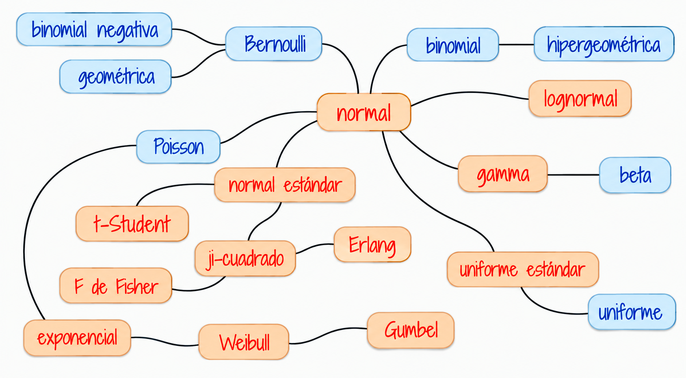
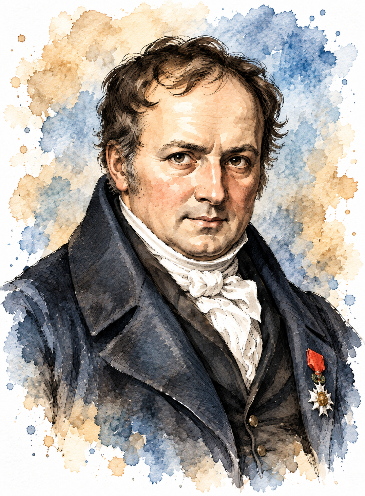

```{r setup, include=FALSE}
knitr::opts_chunk$set(comment = NA)

library(summarytools)
library(devtools)
# install_github("lchiffon/wordcloud2")
library(wordcloud)

# colores
source("R/init.R")

```


```{r, echo=FALSE, out.width="100%", fig.align = "center"}
 
```

# Modelos especiales

<br/><br/>

A continuación se presentan los principales conceptos teóricos de esta unidad, acompañados de ejemplos resueltos. Inicaremos con los modelos discretos


## Introducción

<br/><br/>

En las unidades abordadas previamente a esta se han trabajado las características de variables aleatorias tanto discretas como continuas dentro de  las cuales están: la función de distribución de probabilidad $f(x)$ , para el caso discreto. La función de probabilidad acumulada $F(x)$ que representa $P(X \leq x)$, el valor esperado $E[X]$, la varianza $V[X]$. 

<br/><br/>

Ahora, el siguiente modelo :


$$
f_X(x)=
\begin{cases}
\displaystyle {10\choose x}(p)^x(1-p)^{10-x},
& x=0,1,2,\ldots,10,\\[6pt]
0, & \text{en otro caso}.
\end{cases}
$$
representa un modelo de distribución de probabilidad discreto para una variable con $R_X = \{0,1,2,3,4,5,6,7,8,9,10 \}$ . Que requiere de conocer el parámetro $p$.

<br/><br/>

A este modelo lo vamos a caracterizar y representará una variable que se denomina *binomial*. Al tener un valor para su parámetro $p$, por  ejemplo $p=0.80$, la función nos permitirá calcular cualquier valor de la probabilidad para cada uno de los valores de su rango.

$$
f_X(x)=
\begin{cases}
\displaystyle {10\choose x}(0.80)^x(0.20)^{10-x},
& x=0,1,2,\ldots,10,\\[6pt]
0, & \text{en otro caso}.
\end{cases}
$$
En el caso de $f(3)= \displaystyle {10\choose 3}(0.80)^3(0.20)^{10-3} = 0.000786432$


<br/><br/>

Tener una variable cuyo comportamiento se puede caracterizar tiene la ventaja de conocer fácilmente el recorrido teórico en la construcción del modelo, las propiedades, tendencias, valor esperado, varianza, función de distribución, estimadores de sus parámetros, alternativas que facilitan el cálculo de probabilidades, su afinidad con otras variables, entre otras, características que facilitan actividades como la simulación. 

El siguiente diagrama presenta los principales modelo de probabilidad y sus diferentes relaciones

<br/><br/>


```{r, echo=FALSE, out.width="80%", fig.align = "center"}
 
```


Fuente: construcción propia. basado en Univariate Distribution Relationships  ([Lawrence M. LEEMIS and Jacquelyn T. MCQUESTON](http://www.math.wm.edu/~leemis/2008amstat.pdf))

<br/><br/>

# Modelos discretos

<br/>

## Algunos modelos discretos	

<br/>

|                 |                 |                 |                 |                 |                 | 
|:---------------:|:---------------:|:---------------:|:---------------:|:---------------:|:---------------:|
| Bernoulli       | Binomial        | Poisson         | Hipergeométrico | Geométrico o de Pascal | Binomial negativo|
|                 |                 |                 |                 |                 |                 | 


A continuación se presentan los modelos más comunes con sus principales características:

<br/><br/>

Hemos clasificado como variables discretas aquellas cuyo rango $R_{X}$, corresponde a un conjunto de valores finito o infinito numerables. También es común que estas variables sean asociadas con el conteo, por lo que en su mayoría contienen la palabras **número de...**

A continuación se presentan los principales modelos discretos.

<br/><br/>

# Bernoulli

<br/>

<div class="caja-resena">
<div class="caja-resena-texto">

### Reseña histórica

La distribución de Bernoulli toma su nombre del matemático suizo **Jakob Bernoulli (1655–1705)**, uno de los pioneros de la teoría de la probabilidad. En su obra *Ars Conjectandi* (*El arte de la conjetura*), publicada de manera póstuma en 1713, estudió experimentos con dos resultados posibles y sentó bases fundamentales para el análisis de ensayos repetidos. El modelo Bernoulli constituye hoy la forma más sencilla de representar un experimento aleatorio con resultados de éxito o fracaso.


</div>

<div class="caja-resena-imagen">

</div>
</div>

### Aplicaciones prácticas

El modelo Bernoulli se utiliza cuando interesa representar un resultado dicotómico en un único ensayo. 

* En ingeniería, permite modelar situaciones como el funcionamiento o falla de un componente, la aceptación o rechazo de una pieza y el cumplimiento de una especificación de calidad. 

* En finanzas, puede representar si un crédito entra o no en incumplimiento, si una inversión genera o no una rentabilidad positiva en un periodo, o si una transacción resulta aprobada o rechazada. 

* En general, aparece en estudios médicos, encuestas, control de calidad y cualquier situación que pueda clasificarse mediante dos resultados mutuamente excluyentes.

<br/><br/>

<div class="box4 with-label">
### Distribución Bernoulli
		
Una variable que se distribuye Bernoulli, procede de un experimento Bernoulli, descrito por las siguientes características:
	
* El experimento consta de un ensayo.

* El ensayo solo tiene dos posible resultados: éxito (E), fracaso (F).

* La probabilidad de éxito es $p$, la probabilidad de fracaso es $1-p=q$ 

La variable objeto de estudio es $X$: hay o no éxito éxitos en un ensayo de Bernoulli. Sus principales características son:

Rango : $R_{X}=\{0,1 \}$,
Función de distribución de probabilidad $

$$\begin{equation*}
		f(x)=\left\lbrace
		\begin{array}{lll}
			p & \mbox{si } x=1   \\
			q & \mbox{si } x=0
		\end{array}
		\right.
\end{equation*}$$

$$E[X]= p$$

$$V[X]= pq$$

</div> 

<br/><br/>

<div class="box6 with-label">
### Ejemplo 1
Un grupo de estudiantes del área de Negocios Internacionales realiza una visita a las instalaciones de un puerto marítimo para observar en campo los procesos tanto de importación como de exportación.

Se considera éxito si logran observar y documentar completamente cada uno de los procesos, y fracaso si no pueden observarlos o la información resulta incompleta.

Con base en experiencias previas, la probabilidad de lograrlo se estima en 0.80.

</div>


<br/><br/>

### Solución 

Se requiere examinar si dentro de este contexto existe una variable que proceda de un experimento Bernoulli y ese caso como se podría caracterizar.

 Primero es necesario revisar las características de un experimento Bernoulli y confrontarlas contra el contexto presentado en el ejemplo. 

Primero existe un solo ensayo o salida de campo, durante después de la salida de campo se pueden obtener dos resultados posibles: lograr el objetivo de visualizar y filmar al animal (Éxito) y por otro lado el no lograrlo (Fracaso). También se posee la probabilidad de éxito ($0.20$), este caso establecida mediante el enfoque subjetivo de un experto en un artículo científico. Lo anterior nos permite poder asociar la variable que llamaremos $X$ asociada con el poder o no realizar la filmación.

La variable aleatoria se define en este caso como:

$$X =\left\lbrace
\begin{array}{lll}
	1 & \mbox{si se realiza la filmación del ave}   \\
	0 & \mbox{si no se logra realizar la filmación}
\end{array}
\right.$$

y su función de distribución de probabilidad está dada por:

$$f(x)= 0.2^{x} (1-0.2)^{1-x} ,\text{ si } x=0,1.$$
$$E[X]=p =0.20$$ 

$$V[X] =p(1-p)= 0.16$$
<br/><br/>


# binomial 

<br/>

<div class="caja-resena">
<div class="caja-resena-texto">

### Reseña histórica

La distribución binomial está estrechamente ligada a los trabajos de Jakob Bernoulli, quien estudió la repetición de ensayos con dos resultados posibles en Ars Conjectandi, obra publicada en 1713. Sus investigaciones, motivadas en parte por problemas relacionados con los juegos de azar, permitieron formalizar el estudio del número de éxitos obtenidos al repetir varias veces un mismo experimento. La distribución binomial puede entenderse, por tanto, como una extensión natural del modelo Bernoulli de un ensayo a $n$ ensayos.

</div>

<div class="caja-resena-imagen">

</div>
</div>

<audio controls preload="metadata">
  <source src="audios/binomial-01.wav" type="audio/wav">
</audio>
<br/><br/>

### Aplicaciones prácticas

La distribución binomial permite estudiar el número de éxitos obtenidos en un número fijo de ensayos Bernoulli independientes con igual probabilidad de éxito. 

*En ingeniería: se aplica al número de componentes defectuosos en un lote, equipos que superan una prueba o procesos que cumplen una especificación. 

* En finanzas, puede emplearse para contar créditos que entran en mora, operaciones rentables dentro de un conjunto de transacciones o clientes que aceptan un producto financiero. 

* En general, es útil en encuestas, ensayos clínicos, mercadeo y experimentos donde se cuenta cuántas veces ocurre un evento entre $n$ oportunidades.

<br/>

<div class="box4 with-label">
### Distribución binomial
	
Una variable con distribución binomial es aquella que procede de un experimento binomial. 
	
Ahora un experimento binomial tiene las siguientes características: 
	
* El experimento consta de $n$ ensayos 

* Cada ensayo tiene solo dos posible resultados: éxito (E) o fracaso (F) (experimento Bernoulli),

* La probabilidad de éxito es igual a $p$ y se mantiene fija para todos los ensayos P(E). La probabilidad de fracaso es $(1-p)=q$,

* Los ensayos son independientes,

* La variable objeto de estudio $X$, corresponde al **número de éxitos obtenidos en los $n$ ensayos**.

* Se puede decir que la suma de $n$ variables independientes con distribución Bernoulli($p$), se distribuye de manera Bionomial($n,p$)
	
La función de distribución de probabilidad está dada por:
	
$$\begin{equation*}
		f(x)=\left\lbrace
		\begin{array}{lll}
			\displaystyle\binom{n}{x} p^{x} (1-p)^{n-x} &,& x=0,1,2, \ldots, n   \\
			&&\\
			0 &,& \mbox{en otro caso}
		\end{array}
		\right.
 \end{equation*}$$
	
$$E[X]=np$$

$$V[X]= np(1-p) $$

</div> 


<br/><br/>


<div class="box6 with-label">
### Ejemplo 2

Un sistema de seguridad para casas está diseñado para tener una confiabilidad del 90% . Suponga que diez  casas equipadas con este dispositivo sufrieron tentativa de robo. Se requiere calcular la probabilidad de que en siete de las diez, la alarma se activará. 


</div>

<br/><br/>

### Solución

En este caso la variable $X$ se define como el número de casas de las diez en las que se activa el sistema de alarma. Observe que en cada caso se puede presentar dos posibles resultados frente a la tentativa de robo : 

* La alarma se active (E) o que el sistema falle y no se active (F), los cuales conforman los eventos de exito (E) y fracaso (F).

* Los sistemas operan de manera independiente y se pueden considerar como idénticos.

* La probabilidad de que un equipo se active frente a una tentativa de robo es de 0.9 ($p$) y por tanto la probabilidad de que no funcione será de 0.1 ($q$)

* Se tienen diez casas, que representaría la realización de nueve ensayos, bajo las mismas condiciones.

Por las anteriores razones, el proceso enunciado corresponde a un experimento binomial y por tanto podemos afirmar que la variable X: número de sistemas que se activan ante la tentativa de robo, es una variable con distribución binomial con parámetros $n=10$ y $p=0.90$.

Para calcular la probabilidad requerida utilizamos la función de distribución de probabilidad del modelo Binomial

$$\begin{equation*}
	\begin{array}{lcl}
		f(7) = P(X=7)&=& \displaystyle\binom{10}{7} 0.90^{7} 0.10^{2} \\
		&=& 0.05739563 
	\end{array}
\end{equation*}$$

En R se corre el siguiente código:

```{r}
 dbinom(7,10,0.90)
```

La siguiente gráfica corresponde a la función de distribución de probabilidad del ejemplo2 :binomial con $n=10$ y $p=0.90$

Distribución binomial $n=10$, $p=0.90$
```{r, echo=FALSE, fig.height=3.5, fig.align='center'}
library(ggplot2)
# modelo binomial  ok
x=0:9
fx=dbinom(x,10,0.90)
dat=data.frame(x,fx)


ggplot(dat) + geom_point(aes(x, fx),colour = c31, size = 2) +
  scale_x_continuous(limits = c(0, 10),
                     breaks = c(0,1,2,3,4,5,6,7,8,9,10), 
                     labels = c('0','1','2','3','4','5','6','7','8','9', '10'))
```


<br/>

<div style="display: flex; gap: 30px; align-items: center; justify-content: center;">

  <audio controls preload="metadata">
    <source src="audios/binomial-02.wav" type="audio/wav">
  </audio>

  <audio controls preload="metadata">
    <source src="audios/binomial-03.wav" type="audio/wav">
  </audio>

</div>

 

<br/><br/>


# Poisson

<br/>


<div class="caja-resena">
<div class="caja-resena-texto">

### Reseña histórica

La distribución de Poisson debe su nombre al matemático y físico francés **Siméon Denis Poisson (1781–1840)**. Fue presentada en 1837 en su obra *Recherches sur la probabilité des jugements en matière criminelle et en matière civile*, dentro de sus estudios sobre probabilidades aplicadas a decisiones judiciales. Con el tiempo, el modelo adquirió gran importancia para describir el número de sucesos que ocurren en un intervalo de tiempo, espacio u otra unidad de observación cuando estos eventos aparecen de manera aleatoria.


</div>

<div class="caja-resena-imagen">

</div>
</div>


<audio controls preload="metadata">
  <source src="audios/poisson-01.wav" type="audio/wav">
</audio>

<br/><br/>

### Aplicaciones prácticas

La distribución de Poisson se utiliza para modelar el número de eventos que ocurren en un intervalo de tiempo, espacio, longitud, área u otra unidad de observación, bajo determinados supuestos. 

* En ingeniería, se emplea para estudiar fallas de equipos, defectos por unidad de producción, llegadas a sistemas de servicio, accidentes o interrupciones. 

* En finanzas, puede modelar el número de reclamaciones, incumplimientos, transacciones o llegadas de órdenes durante un periodo. 

* En general, se aplica al conteo de llamadas, pacientes, accidentes, solicitudes, llegadas y otros eventos relativamente poco frecuentes.

<br/>

<div class="box4 with-label">
### Distribución Poisson

La función de distribución de probabilidad de una variable con distribución Poisson esta dada por siguiente la expresión:
	
$\begin{equation*}
		f(x)=\left\lbrace
		\begin{array}{lll}
			\dfrac{\lambda^{x}}{x!} \hspace{.2cm} e^{-\lambda} &,& x \geq 0   \\
			&&\\
			0 &,& \mbox{en otro caso}
		\end{array}
		\right.
	\end{equation*}$
	
Donde $\lambda$ es la cantidad promedio de ocurrencias en el periodo de interés.
	
$$E[X]=\lambda$$

$$V[X]=\lambda $$
La variable objeto de estudio $X$ es el **número de eventos que ocurren por unidad de tiempo, longitud, superficie o volumen**

</div> 
La siguiente gráfica representa la distribución de masa de una variable de Poisson con media 2.

**Distribución Poisson ($\lambda=2$)**

```{r, echo=FALSE, fig.height=3.5, fig.align='center'}
# poiss ok
library(ggplot2)
x=0:10
fx=dpois(x,2)
dat=data.frame(x,fx)


ggplot(dat) + geom_point(aes(x, fx),colour = c31, size = 2) +
  scale_x_continuous(limits = c(0, 10),
                     breaks = c(0,1,2,3,4,5,6,7,8,9,10), 
                     labels = c('0','1','2','3','4','5','6','7','8','9','10'))
```

<br/><br/>

	
<div class="box6 with-label">
### Ejemplo 3

 Se estima que en el cruce más importante de la cuidad, ocurren 2 accidentes por día y se desea valorar la probabilidad de que en un día cualquiera no ocurra ningún accidente en dicho cruce.

</div>

<br/><br/>

### Solución

El número de accidentes que pueden ocurrir en este cruce, para un dia cualquiera, se puede considerar como una variable aleatoria con distribución Poisson, pues la variable hace referencia al número de eventos que se pueden presentar en un determinado espacio de tiempo. 
Para calcular la probabilidad de que no ocurra ningún evento, utilizamos el modelo Poisson:

$$f(0) = P(X = 0) = \dfrac{2^{0}}{0!} \hspace{.2cm} e^{-2}=0.135335$$

```{r}
dpois(0,2)
```

<audio controls preload="metadata">
<source src="audios/poisson-02.wav" type="audio/wav">
</audio>


<br/><br/>

# hipergeometrico

<div class="caja-resena">

<div class="caja-resena-texto">

### Reseña histórica

La distribución hipergeométrica tiene sus raíces en el desarrollo temprano de la combinatoria y de la teoría de la probabilidad, especialmente en los problemas de muestreo de urnas estudiados desde los siglos XVII y XVIII. Su nombre está relacionado con la forma matemática de sus probabilidades y con las series hipergeométricas. El modelo resulta especialmente útil cuando se realizan selecciones **sin reemplazo**, situación en la cual la probabilidad de éxito cambia de una extracción a otra y los ensayos dejan de ser independientes. no suele atribuirse de forma exclusiva a una sola persona. Su origen histórico está ligado al desarrollo de la combinatoria y de la teoría clásica de probabilidades, especialmente a trabajos de Jacob Bernoulli (1655–1705) y Abraham de Moivre (1667–1754).

</div>

<div class="caja-resena-imagen">

</div>
</div>


<audio controls preload="metadata">
<source src="audios/hipergeometrico-01.wav" type="audio/wav">
</audio>


<br/><br/>


### Aplicaciones prácticas

La distribución hipergeométrica es apropiada cuando se selecciona una muestra **sin reemplazo** de una población finita que contiene elementos clasificados en dos categorías. 

* En ingeniería, permite evaluar cuántas piezas defectuosas pueden aparecer al inspeccionar una muestra tomada de un lote. 

* *En finanzas, puede utilizarse en auditorías para estudiar una muestra de operaciones, facturas o cuentas seleccionadas de una población finita. 

* En general , es frecuente en control de calidad, auditoría, muestreo de inventarios y selección de individuos u objetos cuando cada extracción modifica la composición de la población restante.


<br/>

<div class="box4 with-label">
### Distribución hipergeometrica 
	
Se tiene un conjunto de $N$ objetos que contiene $K$ objetos clasificados como éxitos y $N-K$ objetos clasificados como fracasos. Una muestra de tamaño $n$ objetos es seleccionada al azar (sin reemplazo) de la población de $N$ objetos, donde $K \leq N$ y $n \leq N $. La variable de interés $X$ corresponde al **número de éxitos obtenidos en la muestra**. 
	
Su función de masa de probabilidad esta dada por 
	
$$\begin{equation*}
		f(x)=\left\lbrace
		\begin{array}{lll}
			\dfrac{\displaystyle\binom{K}{x} \displaystyle\binom{N-K}{n-x}}{\displaystyle\binom{N}{n}} &, {\text{ si }\max(0,K+n-N) \leq x \leq \min(n,K) }&   \\
			&\\
			0, \mbox{en otro caso}
		\end{array}
		\right.
	\end{equation*}$$
	
	
$$E[X]=\dfrac{nK}{N}$$
$$V[X]=n\Bigg(\frac{K}{N}\Bigg) \Bigg(1-\dfrac{K}{N}\Bigg)\Bigg(\dfrac{N-n}{N-1}\Bigg)$$
	
</div> 

**Distribución binomial hipergeometrica ($m=95, n=5, k=10$)**

```{r, echo=FALSE, fig.height=3.5, fig.align='center'}
# hyper ok
library(ggplot2)
x=5:10
fx=dhyper(x,95,5,10)
dat=data.frame(x,fx)


ggplot(dat) + geom_point(aes(x, fx),colour = c31, size = 2) +
  scale_x_continuous(limits = c(5, 10),
                     breaks = c(5,6,7,8,9,10), 
                     labels = c('5','6','7','8','9','10'))
```

<br/><br/>


<br/>


<div class="box6 with-label">
### Ejemplo 4

Las tarjetas de circuito impreso se someten a una prueba de funcionamiento antes de ser ensambladas en un dispositivo de seguridad, después de ser rellenado con chips semiconductores. Un lote de estas tarjetas contiene 140 unidades y se seleccionan aleatoriamente 20 sin reemplazo para realizar una prueba de control de calidad internacional. Si 5 tarjetas son defectuosas, ¿cuál es la probabilidad de que al menos 1 tarjeta defectuosa aparezca en la muestra? (3-92.  Mongomery) 

</div>

<br/><br/>

### Solución 

$\begin{eqnarray*}
	P(X\geq 1)=1-P(X=0)
	&=& 1 - \dfrac{\displaystyle\binom{5}{0}\displaystyle\binom{135}{20}}{\displaystyle\binom{140}{20}}\\
	&=& 1-\big[ 0.4570594  \big] \\
	&=& 0.5429406
\end{eqnarray*}$


```{r}

phyper(0,5,135,20, lower.tail = FALSE)
```


<audio controls preload="metadata">
<source src="audios/hipergeometrico-02.wav" type="audio/wav">
</audio>


<br/><br/>

# geométrico o de Pascal


<div class="caja-resena">

<div class="caja-resena-texto">

### Reseña histórica

La distribución geométrica surgió en el contexto de los primeros estudios sistemáticos sobre ensayos repetidos desarrollados durante los siglos XVII y XVIII. Está vinculada a los trabajos de **Blaise Pascal** y, posteriormente, de **Jakob Bernoulli**, cuya obra *Ars Conjectandi* consolidó muchas de las ideas fundamentales sobre sucesiones de ensayos Bernoulli.

</div>

<div class="caja-resena-imagen">

</div>

</div>

<audio controls preload="metadata">
<source src="audios/pascal-01.wav" type="audio/wav">
</audio>


<br/><br/>

### Aplicaciones prácticas

La distribución geométrica modela el número de ensayos necesarios hasta obtener el primer éxito en una secuencia de ensayos Bernoulli independientes. 

* En ingeniería, puede representar el número de intentos necesarios hasta lograr una transmisión correcta, detectar una falla o conseguir que un proceso cumpla una condición. 

* En finanzas, puede describir el número de operaciones hasta obtener la primera ganancia bajo un modelo simplificado o el número de contactos hasta conseguir la primera respuesta favorable. 

* En general, resulta útil para analizar tiempos de espera expresados como número de intentos hasta la primera ocurrencia de un evento.


Este modelo describe el número de ensayos necesarios hasta obtener el primer éxito. Los valores que puede tomar esta variable son:

<br/>

|	$x$   | eventos          |  $f(x)$       |                
|:------|:-----------------|:--------------|
|	$1$   |  $E$             | $p$           |
|	$2$   |  $FE$            | $p(1-p)$      |
|	$3$   |  $FFE$           | $p(1-p)^{2}$  |
|	$4$   |  $FFFE$          | $p(1-p)^{3}$  |
|	$5$   |  $FFFFE$         | $p(1-b)^{4}$  |
|       |                  |               |
|	$x$   |  $FFFF \ldots FE | $p(1-p)^{x-1}$| 

<br/>

La variable $X$ toma el valor de $1$ cuando el éxito ocurre en el primer intento. Cuando el primer éxito ocurre en el evento dos, $X$ es igual a $2$, es decir que la variable con distribución geométrica corresponde al **número del evento donde ocurre el primer éxito**.

<br/>

<div class="box4 with-label">
### Distribución geométrica

$$\begin{equation*}
		f(x)=\left\lbrace
		\begin{array}{lll}
			p(1-p)^{x-1}	 &,& x \geq 1   \\
			&&\\
			0 &,& \mbox{en otro caso}
		\end{array}
		\right.
\end{equation*}$$
	
	
$$E[X]=\dfrac{1}{p}$$

$$V[X]=\dfrac{1-p}{p^{2}} $$

</div> 

Nota: En R la variable corresponde al **número de fracasos necesarios para obtener el primer exito**
<br/><br/>


**Distribución geométrica o de Pascal ($p=0.2$)**

```{r, echo=FALSE, fig.height=3.5, fig.align='center'}
# geom 
library(ggplot2)
x=1:10
fx=dgeom(x,0.2)
dat=data.frame(x,fx)


ggplot(dat) + geom_point(aes(x, fx),colour = c31, size = 2) +
  scale_x_continuous(limits = c(1, 10),
                     breaks = c(1,2,3,4,5,6,7,8,9,10), 
                     labels = c('1','2','3','4','5','6','7','8','9','10'))
```
 
 
<br/><br/>

<div class="box6 with-label">
En una línea de producción, los componentes electrónicos son sometidos a una prueba de control de calidad para determinar si presentan o no un defecto de fabricación. La probabilidad de que un componente seleccionado presente el defecto es 0.2.
Los componentes se inspeccionan uno a uno y de manera independiente.
¿Cuál es la probabilidad de que sea necesario inspeccionar 3 o más componentes antes de detectar el primer componente defectuoso?

</div>

<br/><br/>

### Solución 
$$
\begin{aligned}
P(X \geq 3)
    &= 1-P(X\leq 2)\\
    &= 1-\left[P(X=1)+P(X=2)\right]\\
    &= 1-[f(1) + f(2)] \\    
    &= 1-\left[0.2+(0.8)(0.2)\right]\\
    &= 1-\left[0.2+0.16\right]\\
    &= 1-0.36\\
    &= 0.64
\end{aligned}
$$

```{r}
# en el caso de esta distribucion en R
# tiene Rx = 0,1,2,3,.... 
# X representa el numero de fracasos antes de encontrar el primer exito
1-pgeom(1, 0.20)

```


<audio controls preload="metadata">
  <source src="audios/pascal-02.wav" type="audio/wav">
</audio>


<br/><br/>

# binomial negativo

<br/>

<div class="caja-resena">

<div class="caja-resena-texto">

### Reseña histórica

La distribución binomial negativa se desarrolló como una extensión de los modelos asociados con ensayos Bernoulli repetidos y está estrechamente relacionada con la distribución geométrica. Mientras la distribución geométrica estudia el número de ensayos requerido para alcanzar el primer éxito, la binomial negativa generaliza esta idea al número de ensayos necesario para alcanzar un número determinado de éxitos. Su formulación se consolidó con el desarrollo de la teoría de la probabilidad y posteriormente adquirió numerosas aplicaciones en el análisis de datos de conteo.

</div>

<div class="caja-resena-imagen">

</div>

</div>

### Aplicaciones prácticas

La distribución binomial negativa generaliza el modelo geométrico y permite estudiar el número de ensayos necesarios hasta alcanzar un número prefijado de éxitos. 

* En ingeniería, puede representar el número de pruebas requeridas hasta conseguir cierto número de componentes conformes, transmisiones exitosas o eventos de interés. 

* En finanzas, puede utilizarse para modelar el número de operaciones necesarias hasta alcanzar determinado número de resultados favorables y, en otra parametrización, para datos de conteo con variabilidad superior a la que admite un modelo Poisson. 

* En general, se emplea en confiabilidad, seguros, epidemiología y análisis de conteos.

<br/>


<div class="box4 with-label">
### Distribución binomial negativa
	
Se considera una generalización de la distribución Geométrica. En este caso la variable objeto de estudio corresponde a $X$: **número de ensayos requeridos para obtener $r$ éxitos**. Esta variable se obtiene al sumar $r$ variables con distribución Geométrica con igual parámetro $p$.
	
Su función de masa está dada por :

	
$$\begin{equation*}
		f(x)=\left\lbrace
		\begin{array}{lll}
			\displaystyle \binom{x-1}{r-1} p^{r} (1-p)^{x-r}	 &,& x= r, r+1,  \ldots    \\
			&&\\
			0 &,& \mbox{en otro caso}
		\end{array}
		\right.
	\end{equation*}$$

$$E[X]=\dfrac{r}{p}$$

$$V[X]=\dfrac{r(1-p)}{p^{2}}$$	

</div> 

<br/><br/>


**Distribución binomial negativa ($k=2, p=0.50$)**


```{r, echo=FALSE, fig.height=3.5, fig.align='center'}
# nbiom
library(ggplot2)
x=2:10
fx=dnbinom(x,2,0.50)
dat=data.frame(x,fx)


ggplot(dat) + geom_point(aes(x, fx),colour = c31, size = 2) +
  scale_x_continuous(limits = c(2, 10),
                     breaks = c(2,3,4,5,6,7,8,9,10), 
                     labels = c('2','3','4','5','6','7','8','9','10'))
```

	
<br/><br/>

<div class="box6 with-label">
### Ejemplo 6

Un sitio Web está soportado por tres servidores idénticos. Sólo uno de ellos se utiliza para operar el sitio, y los otros dos son de repuesto, los  cuales se activan en caso de que el sistema principal falle. La probabilidad de falla en el sistema principal (o cualquier otro sistema de repuesto activado) ante una solicitud de servicio es 0,0005. Suponiendo que cada solicitud representa un juicio independiente, cuál es el número medio de solicitudes que se espera hasta el fracaso de los tres servidores? 


</div>
 
<br/><br/>

### Solución

$$E[X]=\dfrac{3}{0.0005}= 6000 $$

<audio controls preload="metadata">
<source src="audios/binomial-negativa-02.wav" type="audio/wav">
</audio>

<br/><br/>


<br/><br/><br/><br/>

<div class="box3 with-label">
# Código R

|modelo         | $F(x)$    | $X_{p}$  | $f(x)$  | aleatorio |
|:--------------|:----------|:---------|:--------|:----------|
|Binomial       |	 pbinom   |	qbinom 	 | dbinom  |	rbinom   |
|Geometrica     |	 pgeom    |	qgeom 	 | dgeom   |	rgeom    |
|Hipergeomet.   |	 phyper   | qhyper   | dhyper  |	rhyper   |
|Poisson        | ppois     |	qpois 	 | dpois   |	rpois    |
|Binomial Negativa |pnbinom | qnbinom  |	dnbinom | rnbinom  |  

</div>

<br/><br/><br/>


# Ejemplos de cálculo 

En una variable aleatoria discreta se pueden calcular dos tipos de probabilidades:

$$
f(x)=P(X=x)
$$

corresponde a la probabilidad de que la variable aleatoria tome **exactamente**
el valor $x$, mientras que

$$
F(x)=P(X\leq x)
$$

corresponde a la probabilidad **acumulada** hasta el valor $x$.


<div class="box3 with-label">
| Modelo           | Parámetros del ejemplo |                   | Código R                         | 
|:-----------------|:-----------------------|:------------------|:---------------------------------|
| **Binomial**     | $n=10$                 |$f(4)=P(X=4)$      | `dbinom(4, size=10, prob=0.30)`  | 
|                  | $p=0.30$               |$F(4)=P(X\leq4)$   | `pbinom(4, size=10, prob=0.30)`  |
|                  | $x=4$                  |                   |                                  | 
|                  |                        |                   |                                  | 
| **Geométrica**   | $p=0.25$               |$P(X=3)$           | `dgeom(3, prob=0.25)`            |
|                  | $x=3$                  |$P(X\leq3)$        | `pgeom(3, prob=0.25)`            |
|                  |                        |                   |                                  |
| **Hipergeométrica**| $N=20$               |$f(2)=P(X=2)$      | `dhyper(2, m=7, n=13, k=5)`      |
|                    | $K=7$                |$F(2)=P(X\leq2)$   | `phyper(2, m=7, n=13, k=5)`      |
|                    | $n=5$                |                   |                                  |
|                    | $x=2$                |                   |                                  |
|                    |                      |                   |                                  |  
| **Poisson**      |$\lambda=3$             |$f(2)=P(X=2)$      | `dpois(2, lambda=3)`             |
|                  |$x=2$                   |$F(2)=P(X\leq2)$   | `ppois(2, lambda=3)`             |
|                  |                        |                   |                                  |
| **Binomial negativa** |$r=4$              |$P(X=3)$           | `dnbinom(3, size=4, prob=0.40)`  |
|                       |$p=0.40$           | $P(X\leq3)$       | `pnbinom(3, size=4, prob=0.40)`  |
|                       |$x=3$              |                   |                                  |
</div>

